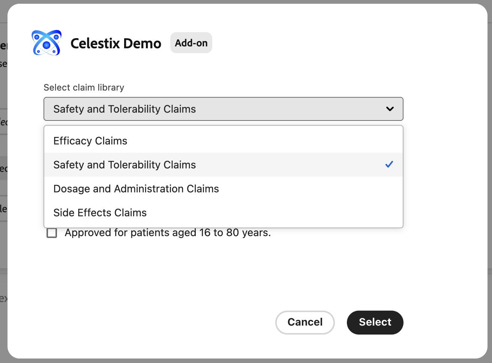
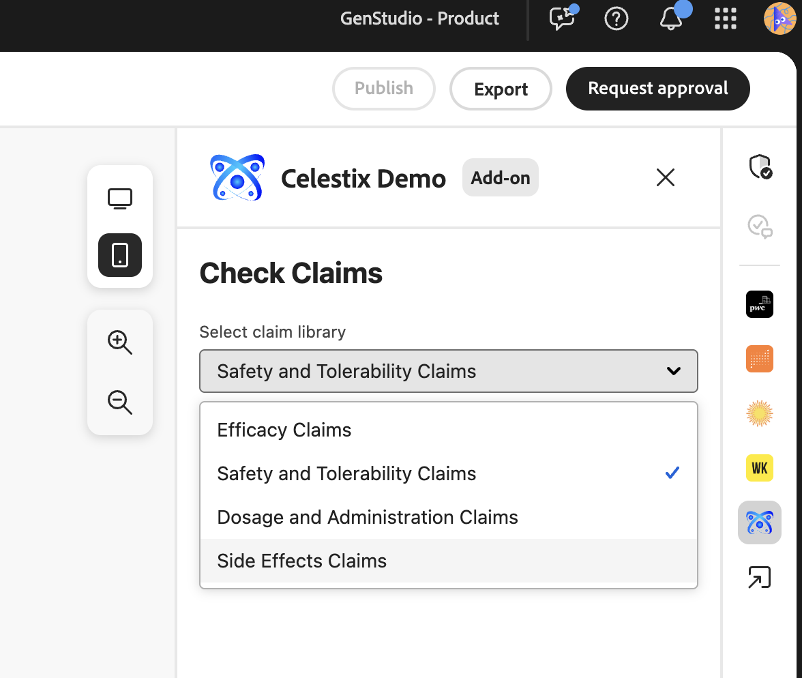
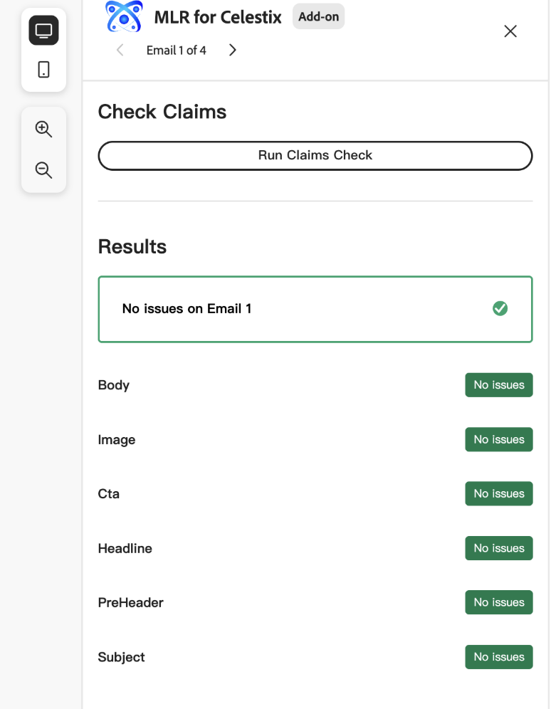
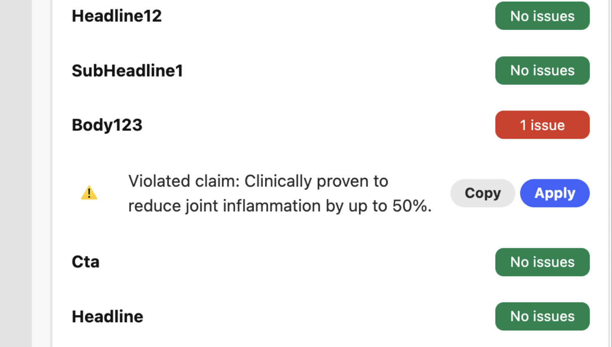

# Bereitstellen der App

Das Ausführen der App bietet einen vorläufigen Schnappschuss des Verhaltens Ihres Add-ons, bevor Sie es bereitstellen. Dies kann beim Debugging helfen.

## Ausführen der App

Ausführen der App in `https://localhost:9080`:

```bash
aio app run
```

## Bereitstellen der App

1. Navigieren Sie zu Ihrem Bereitstellungsarbeitsbereich:

   ```bash
   aio app use -w [deployment_workspace]
   ```

2. Bereitstellen der App:

   ```bash
   aio app deploy
   ```

## Erzwungene Neuverlegung

Sie können die Erstellung und Bereitstellung Ihrer App erzwingen, ohne sie erneut zur Genehmigung einzureichen.

>[!NOTE]
>
>Beim Erzwingen eines Builds und einer Bereitstellung wird die vorhandene Bereitstellung überschrieben. **Testen Sie Ihre App** gründlich in einer Testumgebung.

```bash
aio app build --force-build
```

```bash
aio app deploy --force-deploy
```

## Gleichzeitiges Erstellen und Bereitstellen

```bash
aio app deploy --force-build --force-deploy
```

## Neue App suchen

Nach der Bereitstellung können Sie die neue App in GenStudio for Performance Marketing anzeigen.

### Mit URL anzeigen

Sehen Sie sich die neue App an, indem Sie der GenStudio for Performance Marketing-URL einen `query` hinzufügen:

```txt
https://experience.adobe.com/?ext=https://<my-deployed-add-on>.adobeio-static.net/index.html#/@<ims-org>/genstudio/create
```

### In der Benutzeroberfläche anzeigen

Je nach dem Typ der bereitgestellten Erweiterung befinden sich neue Erweiterungen an verschiedenen Stellen in der Benutzeroberfläche. Die derzeit verfügbaren Erweiterungspunkte sind:

* Compliance-Erweiterung, die Folgendes umfasst:
   * [*Prompt-Erweiterungspunkte*](#find-prompt-extensions) mit denen Kunden zusätzlichen Kontext zur LLM-Generierung hinzufügen können, und
   * [*Validierungs-Erweiterungspunkte*](#find-validation-extensions) mit denen Kunden den generierten Inhalt aus dem LLM überprüfen können. Die Validierung wird häufig mit einer sofortigen Erweiterung gepaart, um sicherzustellen, dass der mit einer verlängerten Eingabeaufforderung generierte Inhalt den Kundenanforderungen entspricht (z. B. Ansprüche auf medizinische Medikamente oder rechtliche Vorschriften)
* [Erweiterung für Digital Asset Management (DAM)](#find-dam-extensions)
* [Vorlagenerweiterung](#find-template-extensions)
* [Übersetzungs-Erweiterung](#find-translation-extensions)
* [Inhaltsfragment-Erweiterung](#find-content-fragment-extension)

### Prompt-Erweiterungen suchen

Eingabeaufforderungserweiterungen finden Sie im Dropdown **Menü „Add** ons“ im **Parameter** einer Vorlage.

{width="600" zoomable="yes"}

Das Add-On-Dialogfeld wird geöffnet. Darin können Sie den zusätzlichen Kontext auswählen, der für die LLM-Generierung hinzugefügt werden soll.

{width="600" zoomable="yes"}

### Validierungserweiterungen suchen

Validierungs-Erweiterungen finden Sie nach einer Eingabeaufforderungsgenerierung in der rechten Leiste, die mit den Ergebnissen angezeigt wird.

{width="600" zoomable="yes"}

Führen Sie die ausgewählte Erweiterung aus, um den generierten Inhalt zu validieren.

{width="600" zoomable="yes"}

Wenn Fehler auftreten, können Sie die Erweiterung verwenden, um die Kopie der Erlebnisse programmgesteuert zu aktualisieren. Durch Klicken auf **[!UICONTROL Kopieren]** wird der vorgeschlagene Text in die Zwischenablage kopiert. Durch Klicken auf **[!UICONTROL Anwenden]**-Schaltfläche wird der Text auf ein bestimmtes Textfeld im generierten Erlebnis angewendet.

{width="600" zoomable="yes"}

### DAM-Erweiterungen suchen

DAM-Erweiterungen (Digital Asset Management) werden gefunden, wenn Sie im Abschnitt **Parameter** einer Vorlage Inhalte auswählen. Unten im Dropdown-Menü **Speicherort auswählen** finden Sie Add-ons.

{width="600" zoomable="yes"}

### Vorlagenerweiterungen suchen

Vorlagenerweiterungen finden Sie auf der Registerkarte **Externe Vorlagenanwendung** bei der Auswahl einer Vorlage. Diese Registerkarte wird nur angezeigt, wenn Vorlagen-Apps ausgewählt werden können.

{width="600" zoomable="yes"}

### Suchen von Übersetzungserweiterungen

Verwenden Sie Übersetzungs-Erweiterungspunkte , um Ihren eigenen Übersetzungs-Service über einen Proxy zu übertragen, anstatt die standardmäßige GenStudio-Übersetzung zu verwenden.
Für diese Erweiterungen gibt es keinen Speicherort auf der Benutzeroberfläche.

Wenn die Erweiterung registriert ist, wird der bereitgestellte Übersetzungs-Service verwendet. Andernfalls wird der standardmäßige GenStudio-Übersetzungs-Service verwendet.

### Inhaltsfragmenterweiterung suchen

Die Inhaltsfragment-Erweiterung in [!DNL GenStudio for Performance Marketing] ersetzt Text in generierten E-Mail-Erlebnissen auf der [!DNL Create]-Arbeitsfläche durch Einträge aus einem verbundenen Drittanbieter-Repository (3P). Nachdem Sie die Erweiterung konfiguriert und bereitgestellt haben, tauschen Sie die Kopie aus der Arbeitsfläche aus, ohne den Workflow verlassen zu müssen.

>[!NOTE]
>
>Der Austausch von Inhaltsfragmenterweiterungen ist heute für E **Mail**-Erlebnisse auf der Arbeitsfläche verfügbar. **Horizon**-Channel-Support ist in Kürze verfügbar.

**So tauschen Sie Text mithilfe der Inhaltsfragment-Erweiterung aus**:

1. Klicken Sie auf der Arbeitsfläche in einer generierten E-Mail-Variante auf ein bearbeitbares Textfeld.
1. Klicken Sie **[!UICONTROL Wechseln]**.
   {width="400" zoomable="yes"}
1. Wählen Sie das Repository eines Drittanbieters aus. Ihr Unternehmen steuert, welche Repositorys angezeigt werden und wie sich die Repository-Benutzeroberfläche verhält.
1. Wählen Sie den Anspruch aus, den Sie als Ersatztext für das Feld verwenden möchten.

Wenn Sie mit Ihrem Add-on zufrieden sind, können Sie es ohne den `query` verteilen.

Jetzt können Sie [Ihre App verteilen](distribute-app.md).
