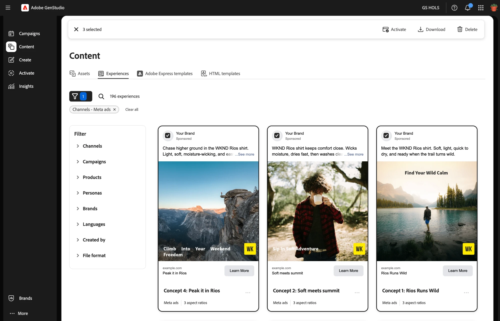
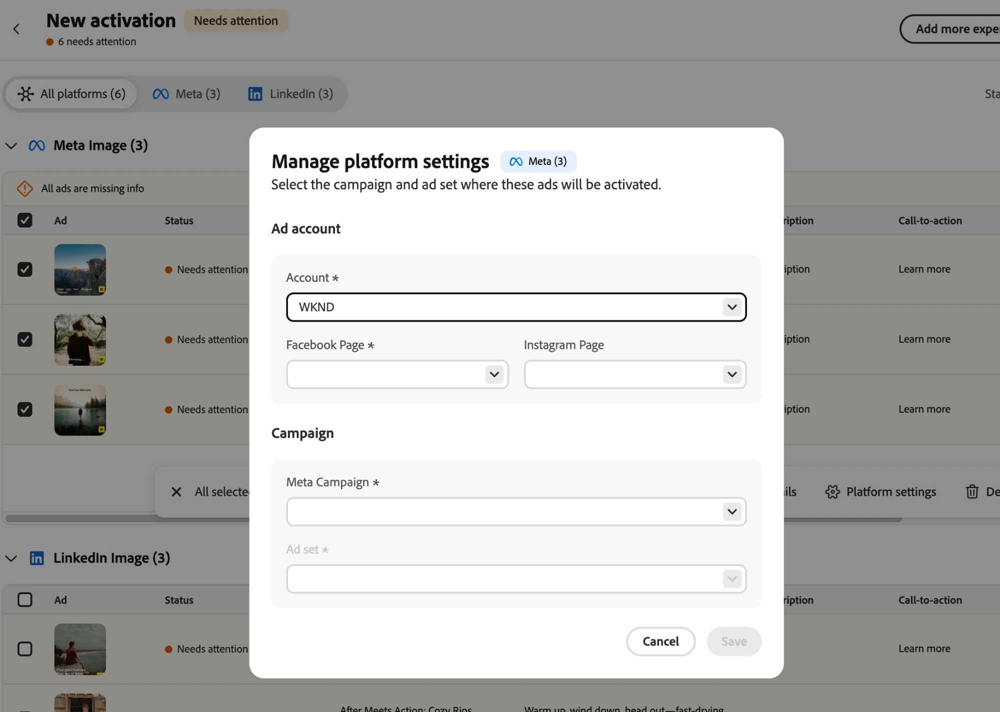

# Aktivierungs-Workflow

[!DNL Activate] aktiviert veröffentlichte Erlebnisse auf ihren Paid-Ad-Plattformen. Ein GenStudio for Performance Marketing-Erlebnis ist eine Marketing-Kampagnenkomponente (z. B. eine Anzeige), die für eine bestimmte Zielgruppe auf einer kostenpflichtigen Anzeigenplattform vorbereitet wird. Die zu aktivierenden Erlebnisse umfassen drei Hauptkomponenten:

* **Medien-Assets**: Bilder oder Videos in Ihrem Anzeigenerlebnis in Dateitypen und Seitenverhältnissen, die je nach Plattform und Format variieren.

* **Text**: Alle in Ihrer Anzeige enthaltenen Formen von Kopien, einschließlich Überschriften, Textkörper und call-to-action-Elemente.

* **Metadaten**: Benutzerdefinierte Attribute, die für die Anzeigenzielgruppe normalerweise nicht sichtbar sind und die Leistungsanalyse, Filterung und Verfolgung verbessern.

Sie bereiten diese Komponenten vor der Aktivierung in [!DNL Content] vor und genehmigen sie. [!DNL Activate] erstellt oder bearbeitet keine genehmigten Assets, Überschriften oder Textkörper. Es wird nur das Setup angewendet, das jede Plattform benötigt, und dann das Erlebnis veröffentlicht.

Eine einzelne Aktivierungstabelle kann Erlebnisse für mehrere Paid-Ad-Plattformen und Anzeigenformate enthalten.

>[!VIDEO](https://video.tv.adobe.com/v/3503538?learn=on)

## Verbinden Ihrer Platform-Konten

Ein GenStudio-Systemmanager oder -Editor muss die Werbekonten für jede bezahlte Werbeplattform verbinden, bevor Sie ein Erlebnis für diese Plattform aktivieren können. Die Schritte für diesen Prozess finden Sie unter [Paid-Media-Konten verbinden](/help/user-guide/connectors/connect-channel.md).

## Starten einer Aktivierung

Starten einer Aktivierung von einem von zwei Einstiegspunkten aus:

* **Von[!DNL Content]**: Filtern Sie nach Erlebnissen, wählen Sie ein oder mehrere veröffentlichte Erlebnisse aus und klicken Sie dann **[!UICONTROL der oberen Aktionsleiste]** Aktivieren“.

  

* **Von[!DNL Activate]**: Klicken Sie auf der [!DNL Activate] Landingpage auf **[!UICONTROL + Neue Aktivierung]**. Dadurch wird dieselbe Erlebnisgalerie geöffnet, in der Sie Erlebnisse zur Aktivierung auswählen.

Suchen Sie in beiden Fällen nach Erlebnisnamen oder filtern Sie nach mehreren Kanälen, um die gewünschten Erlebnisse zu finden.

Wenn Sie Erlebnisse im Anzeigeformat auswählen, geben Sie an, welche Anzeigeplattform verwendet werden soll: Google Campaign Manager 360, Innovid, Amazon Ads oder The Trade Desk. Klicken Sie dann auf **[!UICONTROL Aktivierung starten]**. Für andere Formate wie Meta, LinkedIn, TikTok, YouTube und ChatGPT leitet [!DNL Activate] die Plattform aus dem Kanal des Erlebnisses ab und überspringt diesen Schritt.

[!DNL Activate] generiert dann eine Aktivierungstabelle, in der alle ausgewählten Erlebnisse aufgelistet sind.

[!DNL Activate] organisiert die Tabelle nach Anzeigenformat und Plattform in Untertabellen, z. B. Einzelbild von Meta oder Einzelbild von LinkedIn. Jede Zeile stellt eine Anzeige dar. Bei den meisten Plattformen, z. B. LinkedIn, TikTok und Anzeigeplattformen, erzeugt ein Erlebnis mit mehreren Seitenverhältnissen ein Seitenverhältnis von einer Zeile pro Zeile. Löschen Sie alle Zeilen, die Sie nicht benötigen. Meta bildet die Ausnahme. Eine Meta-Anzeige kann mehrere Seitenverhältnisse in einer einzigen Anzeige enthalten, sodass ein Meta-Erlebnis mit mehreren Seitenverhältnissen immer noch nur eine Zeile generiert.

## Verwalten der Aktivierungstabelle

Ihre Aktivierungstabelle wird beim Öffnen automatisch als Entwurf gespeichert. Sie können den Entwurf jederzeit vor der Veröffentlichung verlassen und fortsetzen.

Um einer bereits geöffneten Aktivierungstabelle weitere Erlebnisse hinzuzufügen, klicken Sie **[!UICONTROL oben rechts in der Tabelle auf]** Weitere Erlebnisse hinzufügen“. Dadurch wird die Erlebnisgalerie erneut geöffnet, sodass Sie zusätzliche Erlebnisse auswählen können, die [!DNL Activate] zur vorhandenen Tabelle hinzufügt.

**[!UICONTROL Weitere Erlebnisse hinzufügen]** ermöglicht auch die Aktivierung auf mehr als einer Anzeigeplattform in derselben Tabelle. Bei Erlebnissen im Anzeigeformat müssen Sie zunächst eine einzelne Anzeigeplattform auswählen, aber Sie können auf **[!UICONTROL Weitere Erlebnisse hinzufügen]** klicken, weitere Erlebnisse im Anzeigeformat auswählen und eine andere Anzeigeplattform auswählen, als die, die sich bereits in Ihrer Tabelle befindet. Sie können beispielsweise The Trade Desk-Anzeigen zu einer Tabelle hinzufügen, die bereits Innovid-Anzeigen enthält.

Sobald Ihre Tabelle die richtigen Erlebnisse hat, konfigurieren Sie als Nächstes die Felder jeder Anzeige.

## Konfigurieren von Anzeigen- und Platform-Setup-Details

Bearbeiten Sie die Felder inline pro Zeile oder wählen Sie mehrere Zeilen innerhalb derselben Formattabelle aus und klicken Sie auf **[!UICONTROL Details bearbeiten]** auf der Symbolleiste, die angezeigt wird, um diese Felder gleichzeitig in großen Mengen zu bearbeiten.

Genehmigte Assets, Überschriften und Textkörper sind gesperrt und können in der Aktivierungstabelle nicht bearbeitet werden, da sie bereits in [!DNL Content] überprüft und genehmigt wurden. Die verbleibenden Felder können bearbeitet werden und variieren je nach Plattform. [!DNL Activate] werden nur die Spalten angezeigt, die für die ausgewählten Plattformen und Formate relevant sind. Verwenden Sie die nachstehende Tabelle als Referenz für das, was pro Plattform bearbeitbar ist.

**Bearbeitbare Felder nach Plattform**

| Plattform | Unterstützte Formate | Gesperrte Kopie | Bearbeitbare Textfelder | Bearbeitbare Felder für die Plattformeinrichtung |
|---|---|---|---|---|
| Meta | Bild, Video, Karussell | Überschrift, Textkörper | Beschreibung, Call-to-action, Ziel-URL, URL-Parameter, Tracking-ID | Werbekonto, Facebook-Seite, Instagram-Profil, Meta Campaign, Meta-Anzeigensatz |
| LinkedIn | Einzelbild, einzelnes Video | Überschrift, Einführungstext | Beschreibung, Call-to-action, Ziel-URL, URL-Parameter, Tracking-ID | Werbekonto, Kampagne, Anzeigensatz |
| Google Campaign Manager 360 | Statische Anzeige, Videoanzeige, HTML5 ZIP-Anzeige | k. A. | Tracking-ID | Inserentin |
| Amazon Ads | Statische Anzeige | k. A. | Tracking-ID | Konto |
| Innovid | Statische Anzeige, HTML5 ZIP-Anzeige | k. A. | Tracking-ID | Account, Creative Library, Concept Name |
| TikTok | In-Feed-Videoanzeigen | Primärer Text | Call-to-action, Ziel-URL, Tracking-ID | Werbekonto, Kampagne, Anzeigengruppe |
| YouTube | Shorts in Google Ads Demand Gen-Kampagnen | Beschreibung | Call-to-action, Geschäftsname, Ziel-URL, URL-Parameter, Tracking-ID | Konto, Kampagne, Anzeigengruppe, Logo |
| ChatGPT | Chat-Karten | Titel, Textkörper | Ziel-URL, Tracking-ID | OpenAI-Anzeigenkonto, OpenAI-Kampagne, OpenAI-Anzeigengruppe |
| The Trade Desk | Statische Anzeige | k. A. | Tracking-ID | Konto, Kampagne |

Um die Felder der Plattformeinrichtung für eine Gruppe von Anzeigenformaten zu konfigurieren, klicken Sie auf **[!UICONTROL Plattformeinstellungen verwalten]** und bearbeiten Sie die Felder im daraufhin angezeigten Dialogfeld.

Jedes **[!UICONTROL Tracking-ID]**-Feld ist mit dem Erlebnisnamen vorausgefüllt: Die Anzeigenplattform verwendet diesen Wert als Namen der Anzeige oder als kreativen Namen für die Berichterstellung und Fehlerbehebung. Bearbeiten Sie den Wert an Ort und Stelle, wenn Sie etwas Anderes verwenden möchten.

Um schneller zwischen **[!UICONTROL Tracking-ID]**-Feldern zu wechseln, verwenden Sie diese Tastaturbefehle:

* Drücken Sie **Eingabetaste**, um das Bearbeitungsfeld für die ausgewählte **[!UICONTROL Tracking-ID]** zu öffnen.
* Drücken Sie die **Nach** oder **Nach-unten**-Taste, um zum vorherigen oder nächsten Feld **[!UICONTROL Tracking-ID]** in dieser Spalte zu wechseln.
* Drücken Sie **Eingabetaste** erneut, um die Bearbeitung zu speichern.

## Erlebnisse überprüfen und auf ihren Anzeigenplattformen veröffentlichen

Bestätigen Sie, dass in jeder Zeile der Status [!UICONTROL Bereit zum Aktivieren] angezeigt wird. [!DNL Activate] kennzeichnet fehlende oder ungültige Felder, inkompatible Aktionsaufrufe und doppelte Tracking-IDs mit dem Status [!UICONTROL Erfordert Aufmerksamkeit]. Wenn jede Zeile fertig ist, klicken Sie auf **[!UICONTROL An Plattformen senden]** und bestätigen Sie dies im Dialogfeld „Veröffentlichen“.

[!DNL Activate] meldet den Status jeder Anzeige nahezu in Echtzeit: Ausstehend, dann an Plattformen gesendet oder fehlgeschlagen. Wenn eine Anzeige fehlschlägt, bewegen Sie den Mauszeiger über ihren Status, um den Fehler der Plattform anzuzeigen. Sie können jede fehlgeschlagene Anzeige in der Tabelle auf einmal wiederholen, indem Sie auf **[!UICONTROL Erneut versuchen]** klicken, anstatt jede Anzeige einzeln erneut zu versuchen. Zeilen, die bereits an Plattformen gesendet wurden, sind von der erneuten Übermittlung gesperrt und enthalten einen Deep-Link zur Anzeige im nativen Anzeigen-Manager der Zielplattform. Ihre abschließende Prüfung vor der Veröffentlichung und das Starten von Anzeigen erfolgt im eigenen Anzeigenmanager der Zielplattform: [!DNL Activate] stellt Anzeigen immer in einem inaktiven Status bereit.

Ihre Aktivierungstabellen werden auf der [!DNL Activate] Landingpage angezeigt.

## Unterstützte Plattformen

Jede bezahlte Werbeplattform verfügt über bestimmte Einrichtungsfelder und Voraussetzungen. Wählen Sie die kostenpflichtige Anzeigenplattform für Aktivierungsrichtlinien aus:

* [Meta](activate-meta-ad.md)
* [LinkedIn](activate-linkedin-ad.md)
* [Google Campaign Manager 360](activate-cm360-ad.md)
* [Amazon-Anzeigen](activate-amazon-ad.md)
* [Innovid](activate-innovid-ad.md)
* [TikTok](activate-tiktok-ad.md)
* [YouTube](activate-youtube-ad.md)
* [ChatGPT](activate-chatgpt-ad.md)
* [The Trade Desk](activate-trade-desk-ad.md)
