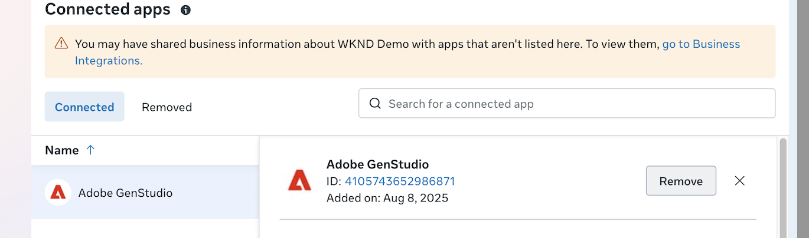

# Mit Meta Ads verbinden

Auf dieser Seite wird beschrieben, wie Sie Ihr Meta Ads-Profilkonto mit GenStudio for Performance Marketing verbinden und verwalten können, um Kampagnen zu verwalten, Inhalte zu exportieren und auf Werbedaten für Ihre aktiven Kampagnen zuzugreifen.

>[!BEGINSHADEBOX]

**Voraussetzungen**:

- Eine Facebook-/Meta-Anmeldung, die auf alle Meta-Services zugreifen kann
- _Vollständige Kontrolle_ über Meta Business Portfolio und Werbekonten, einschließlich:
   - Verwalten von Kampagnen
   - Leistung anzeigen
   - Verwalten von Creative Hub-Mockups
   - Erweiterte Analyse
- Deaktivieren Sie alle Popup-Blocker in Ihrem Browser
- Überprüfen Sie alle Instagram-Kontoseitenverknüpfungen in Meta Business Manager, bevor Sie eine Verbindung herstellen
- Administratorzugriff auf alle verknüpften Assets bestätigen

>[!ENDSHADEBOX]

## Verbinden eines Meta Ads-Kontos

1. Klicken Sie auf **[!UICONTROL Mehr]** > **[!UICONTROL Einstellungen]**.

1. Klicken Sie im Abschnitt _Data Connectors_ auf **[!UICONTROL Verbinden]** der Karte _Meta Ads_.

1. Melden Sie sich bei Ihrem Facebook-Konto an.

   Möglicherweise müssen Sie die Popup-Blocker entfernen und dann mit &quot;**[!UICONTROL &quot;]**, um es erneut zu versuchen.

1. Befolgen Sie die Anweisungen zur Facebook-Authentifizierung, überprüfen Sie die Kontoinformationen und klicken Sie auf **[!UICONTROL Weiter als …]**

1. Gehen Sie _[!UICONTROL Facebook-Anmeldung für Unternehmen]_ (Symbol &quot;Meta zu Adobe„) durch die folgenden Auswahlen, um GenStudio for Performance Marketing Zugriff zu gewähren:

   - Wählen Sie mindestens ein Meta-Geschäftsprofil aus und klicken Sie auf **[!UICONTROL Weiter]**
   - Wählen Sie mindestens eine Meta-Seite aus und klicken Sie auf **[!UICONTROL Weiter]**
   - Wählen Sie ein oder mehrere Instagram-Konten aus und klicken Sie auf **[!UICONTROL Weiter]**
   - Überprüfen Sie die Auswahl und klicken Sie auf **[!UICONTROL Speichern]**

     {width="400" zoomable="yes"}

1. Sobald Sie die Bestätigung erhalten haben, dass Ihr Konto verbunden ist, klicken Sie auf **[!UICONTROL Verstanden]**.

   Dieser Schritt stellt sicher, dass GenStudio for Performance Marketing Zugriff auf alle Anzeigen, Metadaten und Metriken erhält, um eine optimale Leistung zu erzielen.

1. Wählen Sie in _[!UICONTROL Meta Ads]_ ein oder mehrere Konten aus, die in [!DNL Insights] aufgenommen werden sollen, und klicken Sie auf **[!UICONTROL Auswählen]**.

1. Sobald Sie eine Bestätigung für _Platform Connected_ erhalten haben, klicken Sie auf **[!UICONTROL Konten anzeigen]**.

   Die Ansicht _[!UICONTROL Meta Ads]_ listet die `Account name`, `Added by`, `Date added` und `Status` auf.

   {zoomable="yes"}

Verwenden **[!UICONTROL Konto hinzufügen]**, um der Liste weitere Konten hinzuzufügen. Der Autorisierungsfluss kann beim Hinzufügen von Konten, die mit demselben Meta-Geschäftsprofil verknüpft sind, geringfügig abweichen. Sie wählen während des Verbindungsprozesses nur die neuen Meta Ads-Konten aus.

## Verbinden eines Instagram-Kontos

>[!IMPORTANT]
>
>Bevor Sie eine Meta-Anzeige aktivieren, stellen Sie in Meta Business Manager sicher, dass das Instagram-Konto, das Sie verwenden möchten, mit demselben während des Onboardings ausgewählten Werbekonto verbunden ist. Wenn diese Verbindung fehlt, wird das Instagram-Konto während der Aktivierung möglicherweise nicht im Dropdown[!DNL GenStudio for Performance Marketing]Menü _Instagram_ angezeigt.

**So überprüfen oder aktualisieren Sie die Instagram-Kontoverbindung in Meta Business Manager**:

1. Navigieren Sie zu **[!UICONTROL Einstellungen]**.
1. Wählen _unter_ Konten“ **[!UICONTROL Instagram-Konten]** aus.
1. Wählen Sie das Instagram-Konto aus, das Sie verwenden möchten.
1. Klicken Sie auf **[!UICONTROL Connected Assets]**.
1. Bestätigen _unter „Werbekonten_, dass das beim Onboarding verwendete Werbekonto aufgeführt ist.
1. Wenn es nicht aufgeführt ist, klicken Sie auf **[!UICONTROL Assets verbinden]** und fügen Sie das richtige Werbekonto hinzu.

Nachdem das Werbekonto verbunden ist, kehren Sie zu [!DNL GenStudio for Performance Marketing] zurück und setzen Sie den Aktivierungsfluss fort.

## Best Practices für Verbindungen

Um Fehler zu vermeiden, sollten Sie beim Einrichten von Verbindungen die folgenden Best Practices beachten:

- [ ] Start mit minimaler Asset-Auswahl (nur eine Seite) für die erste Verbindung
- [ ] Fügen Sie Instagram-Konten nur hinzu, nachdem Sie bestätigt haben, dass der Seitenzugriff funktioniert
- [ ] Sicherstellen, dass Instagram-Konten ordnungsgemäß mit der ausgewählten Facebook-Seite in Meta Business Manager verknüpft sind
- [ ] Verwenden eines stufenweisen Ansatzes: Zuerst eine Basisverbindung herstellen und dann Assets erweitern
- [ ] Überprüfen der Administratorberechtigungen für alle Assets, bevor eine Verbindung hergestellt wird

## Trennen und Fehlerbehebung bei einer Meta Ads-Integration

Manchmal ist eine GenStudio for Performance Marketing-Instanz falsch mit einem Meta Ads-Konto verbunden. Zu den häufigen Setups, die Probleme verursachen können, gehören:

- Ein Instagram-Konto wird ohne die zugehörige Facebook-Seite ausgewählt
- hat einem Benutzer, der die ursprüngliche Verbindung hergestellt hat, die Berechtigungen entzogen

In diesen Situationen ist es am besten, das Meta Ad-Konto erneut mit der GenStudio for Performance Marketing-Instanz zu verbinden. Zunächst muss die Benutzerin bzw. der Benutzer die App-Integration direkt aus ihrem Meta Business Manager entfernen, um einen Neuanfang für das Zurücksetzen von Berechtigungen zu schaffen. Dies erfordert Administratorzugriff auf den Meta Business Manager.

Mit diesen Schritten werden zwischengespeicherte Berechtigungen gelöscht und der Integrationsfluss zurückgesetzt:

1. Greifen Sie auf [Meta Business Manager](https://business.facebook.com) zu, indem Sie die Facebook-Website besuchen.
1. Melden Sie sich mit Ihrem Konto an. Das Konto muss Administratorzugriff auf den Business Manager haben.
1. Klicken Sie auf **[!UICONTROL Einstellungen]** Zahnradsymbol unten links, um zu Ihren Portfolio-Einstellungen für Ihr Unternehmen zu navigieren.
1. Klicken Sie im Menü links auf &quot;**[!UICONTROL &quot;]**.
1. Wählen Sie **[!UICONTROL Verbundene Apps]** aus. Adobe GenStudio wird in der Liste der verbundenen Apps angezeigt.
   
1. Klicken Sie auf den App-Namen.
1. Klicken Sie auf **[!UICONTROL Entfernen]**.
1. Bestätigen Sie die Entfernung, wenn Sie dazu aufgefordert werden.

Sie können jetzt Ihre Meta-Werbekonten, Instagram-Profile und Facebook-Seiten neu verbinden.

## Verbindungsprobleme mit Instagram-Konten

Probleme können auftreten, wenn Instagram-Konten ausgewählt werden, ohne während der Verbindungseinrichtung eine zugehörige Facebook-Seite zu verbinden. Dies kann zu Fehlern führen wie:

- „Verbindung zu {Page_Name} nicht möglich“ oder allgemeine Verbindungsfehler.
- Verbindungs-Timeouts bei der Facebook-Anmeldung für den Geschäftsfluss.
- Stille Fehler, wenn mehrere Assets ausgewählt werden.
- Die Verbindung schlägt fehl, wenn Instagram, Seite und Werbekonto gleichzeitig ausgewählt werden.

### Auflösungsschritte:

1. Navigieren Sie zu [Meta Business Manager](https://business.facebook.com) > Integrationen > Connected Apps.
1. Entfernen Sie die vorhandene Adobe GenStudio-Integration (sofern vorhanden). Klicken Sie auf **Entfernen**.
1. Kehren Sie zu GenStudio zurück und wiederholen Sie den Verbindungsprozess.
1. Wählen Sie während der ersten Verbindung NUR die Facebook-Zielseite aus.
1. Wählen Sie NICHT das Instagram-Konto beim ersten Verbindungsversuch aus.
1. Überprüfen Sie, ob die Verbindung erfolgreich hergestellt wurde, bevor Sie andere Assets hinzufügen.
1. Sobald die Seitenverbindung stabil ist, fügen Sie Instagram-Konten separat hinzu.
