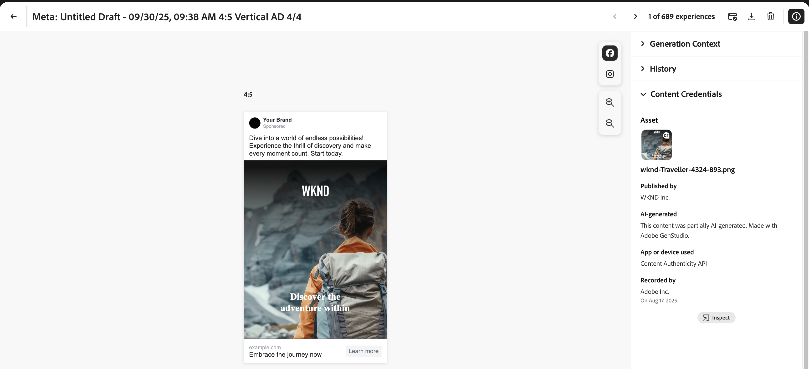

# Content Credentials für Unternehmen

Erfahren Sie, wie manipulationssichere Anmeldeinformationen für Inhalte, die die Markenauthentizität beweisen und die Compliance fördern, direkt in Ihren Marketing-Workflow eingebettet werden.

>[!WARNING]
>
>Diese Funktion befindet sich derzeit in der Beta-Phase und steht nur Organisationen zur Verfügung, die Zugriff erhalten haben. Wenden Sie sich bei Interesse zur Registrierung an Ihren Adobe-Kundenbetreuer.

## Erste Schritte mit Content Credentials

Nachdem Content Credentials in der Admin Console aktiviert wurde, können GenStudio for Performance Marketing-Benutzende Content Credentials für alle Assets global in der App aktivieren. Wenn die globale Option zum Anwenden von Anmeldeinformationen deaktiviert ist, können Benutzerinnen und Benutzer Content Credentials für jedes einzelne Asset anwenden.

Nach der Veröffentlichung von Inhalten ist Content Credentials auf externen Plattformen wie LinkedIn sichtbar.

Admins sind für das Hochladen eines gültigen X.509-Zertifikats in Admin Console verantwortlich. Dadurch wird sichergestellt, dass die digitale Signatur des Unternehmens ordnungsgemäß konfiguriert und für die Verwendung in unterstützten Adobe DX-Anwendungen bereit ist.

>[!NOTE]
>
>Die Kontrolle über diese Einstellung könnte in Zukunft auf Admin Console übergehen, die Verwaltung von Content Credentials anwendungsübergreifend optimieren und die administrative Aufsicht verbessern.

## Was ist Content Credentials? 

Content Credentials sind dauerhafte, dem Branchenstandard entsprechende Metadaten, die Details zur Inhaltserstellung und Identitätsinformationen zu den Erstellern enthalten. Content Credentials kann angezeigt werden, wenn die Inhalte online auf unterstützenden Plattformen veröffentlicht werden, oder mithilfe von Tools wie dem Inspektions-Tool von [Adobe ](https://contentauthenticity.adobe.com/inspect) der Browser-Erweiterung [Adobe Content Authenticity Chrome](https://helpx.adobe.com/creative-cloud/help/cai/adobe-content-authenticity-chrome-browser-extension.html).  

Die Anwendung von Content Credentials kann dazu beitragen, die Transparenz hinsichtlich der Art und Weise, wie Inhalte erstellt wurden, zu erhöhen, und Ihren Benutzenden helfen, sich mit ihren Inhalten zu verbinden.

[Erfahren Sie mehr über Content Credentials](https://helpx.adobe.com/de/creative-cloud/help/content-credentials.html) bei Adobe.

## Markensignatur und Asset-Tracking

Markensignierte Inhalte spielen eine wichtige Rolle bei der Förderung der Markenintegrität und des Benutzervertrauens. Unternehmen können ihren Inhalt in Adobe-Programmen mit einer eindeutigen Markensignatur signieren, wenn ihr Zertifikat in der Admin Console ordnungsgemäß konfiguriert ist. Diese Authentizitätsgarantie wird mithilfe unsichtbarer Wasserzeichen- und Fingerabdrucktechnologien aufrechterhalten, die dazu beitragen, die Dauerhaftigkeit der Signatur während des gesamten Lebenszyklus des Inhalts zu bewahren.

Zusätzlich zur Markensignierung können Unternehmen Asset-IDs direkt an ihren Inhalt anhängen. Dies erleichtert das effiziente Tracking von Assets, insbesondere wenn sie freigegeben oder auf Social-Media-Plattformen gepostet werden. Durch die Integration von Asset-IDs können Unternehmen den Ursprung und den Verteilungspfad ihrer Inhalte verfolgen und so ihre Aufsicht und Rechenschaftspflicht verbessern.

## Content Credentials im Marketing-Workflow

Die Anwendung von Content Credentials kann während des gesamten Marketing-Workflows direkt in GenStudio for Performance Marketing durchgeführt werden, vom Import und der Inhaltserkennung bis hin zur Aktivierung und zum Export. Anmeldeinformationen werden auch auf Inhalten angezeigt, die in der gesamten App überprüft werden können.

### Import und Erkennung

In der Inhaltsgalerie werden Anmeldeinformationen für importierte Assets angezeigt.

Das Content Credential-Badge in der rechten oberen Ecke der Miniaturansicht zeigt Inhalte an, die mit „Markenzeichen“ versehen sind.

{width="350"}

Wenn Sie signierten Inhalt auswählen, werden die detaillierten Metadaten angezeigt: veröffentlichte Marke, verwendeter Recorder, Tool, Zeitstempel.

Inhalte können nach Berechtigungsstatus gefiltert werden.

### Erstellung und Auswahl

Content Credential-Abzeichen werden in der Arbeitsflächen-Asset-Auswahl angezeigt.

Die Metadaten der Anmeldeinformationen werden beibehalten, da Assets für Erlebnisse ausgewählt werden, um die Herkunft während der Bearbeitung beizubehalten.

### Bearbeiten und Transformation

Beim Export aus einem Entwurf werden geänderte Assets automatisch neu signiert und die neuen Anmeldeinformationen sind mit dem Original verknüpft.

{width="300"}

### Überprüfung und Genehmigung

In der Vorschau Überprüfen und Genehmigen wird der Status der Berechtigung für Assets in der rechten Leiste angezeigt.

{width="300"}

Die Anmeldeinformationen für die einzelnen Varianten werden angezeigt, wenn Reviewer die Assets überprüfen. Genehmigte Erlebnisse werden erneut signiert, wenn Benutzende auf **[!UICONTROL Im Inhalt speichern]** klicken.

### Aktivierung und Export

Während der Aktivierung wird der Berechtigungsstatus im Experience Selektor angezeigt.

{width="350"}

Exportierte Dateien verfügen über eingebettete C2PA-konforme Anmeldeinformationen.

Die Integrität der Anmeldeinformationen wird für alle unterstützten Formate (JPEG, PNG, MP4) gewahrt.

