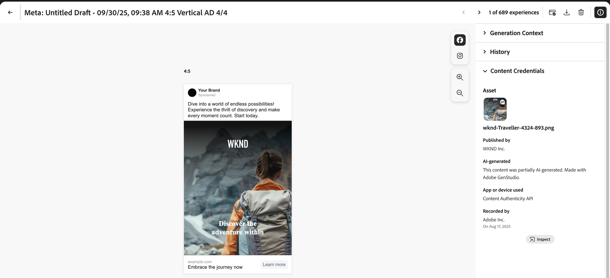

# Content Credentials for organizations

Learn how tamper-proof credentials for content that prove brand authenticity and drive compliance are embedded directly in your marketing workflow.

>[!WARNING]
>
> This feature is currently in beta and is only available to organizations that have been granted access. If interested, please reach out to your Adobe account team representative or [use this link to request enrollment](https://www.feedbackprogram.adobe.com/c/a/5aWPEOthrDv22Mf9CyekOy?source=qr).

## Get started with Content Credentials {#content-credentials}

>[!CONTEXTUALHELP]
>id="gspm_content_credentials"
>title="Content Credentials in [!DNL GenStudio for Performance Marketing]"
>abstract="Tamper-proof credentials for content that prove brand authenticity and drive compliance can be embedded directly in your marketing workflow."

After Content Credentials have been activated in the Admin Console, GenStudio for Performance Marketing users can turn on Content Credentials for all assets globally in the app. If the global option to apply credentials is turned off, users have the choice to apply Content Credentials for each individual asset.

Once content is published, Content Credentials will be visible on external platforms, like LinkedIn.

Administrators are responsible for uploading a valid X.509 certificate within the Admin Console. This step ensures that the enterprise&#39;s digital signature is properly configured and ready for use in supported Adobe DX applications.

>[!NOTE]
>
>Control over this setting might transition to the Admin Console in the future, streamlining the management of Content Credentials across applications and enhancing administrative oversight.

## What are Content Credentials? 

Content Credentials are a durable, industry-standard type of metadata with details about how content was made and identity information about the creators. Content Credentials can be viewed when the content is published online to supporting platforms, or by using tools like [Adobe&#39;s Inspect tool](https://contentauthenticity.adobe.com/inspect) or the [Adobe Content Authenticity Chrome browser extension](https://helpx.adobe.com/creative-cloud/help/cai/adobe-content-authenticity-chrome-browser-extension.html).  

Applying Content Credentials can help increase transparency about how content was made and can help your users connect themselves to their content.

[Learn more about Content Credentials](https://helpx.adobe.com/de/creative-cloud/help/content-credentials.html) at Adobe.

## Brand signature and asset tracking

Brand-signed content plays a significant role in promoting brand integrity and user trust. Unternehmen können ihren Inhalt in Adobe-Programmen mit einer eindeutigen Markensignatur signieren, wenn ihr Zertifikat in der Admin Console ordnungsgemäß konfiguriert ist. Diese Authentizitätsgarantie wird mithilfe unsichtbarer Wasserzeichen- und Fingerabdrucktechnologien aufrechterhalten, die dazu beitragen, die Dauerhaftigkeit der Signatur während des gesamten Lebenszyklus des Inhalts zu bewahren.

Zusätzlich zur Markensignierung können Unternehmen Asset-IDs direkt an ihren Inhalt anhängen. Dies erleichtert das effiziente Tracking von Assets, insbesondere wenn sie freigegeben oder auf Social-Media-Plattformen gepostet werden. Durch die Integration von Asset-IDs können Unternehmen den Ursprung und den Verteilungspfad ihrer Inhalte verfolgen und so ihre Aufsicht und Rechenschaftspflicht verbessern.

## Content Credentials im Marketing-Workflow

Die Anwendung von Content Credentials kann während des gesamten Marketing-Workflows direkt in GenStudio for Performance Marketing durchgeführt werden, vom Import und der Inhaltserkennung bis hin zur Aktivierung und zum Export. Anmeldeinformationen werden auch auf Inhalten angezeigt, die in der gesamten App überprüft werden können.

### Import und Erkennung

In der Inhaltsgalerie werden Anmeldeinformationen für importierte Assets angezeigt.

Das Content Credential-Badge in der rechten oberen Ecke der Miniaturansicht zeigt Inhalte an, die mit „Markenzeichen“ versehen sind.

Wenn Sie signierten Inhalt auswählen, werden die detaillierten Metadaten angezeigt: veröffentlichte Marke, verwendeter Recorder, Tool, Zeitstempel.

Inhalte können nach Berechtigungsstatus gefiltert werden.

### Erstellung und Auswahl

Content Credential-Abzeichen werden in der Arbeitsflächen-Asset-Auswahl angezeigt.

Die Metadaten der Anmeldeinformationen werden beibehalten, da Assets für Erlebnisse ausgewählt werden, um die Herkunft während der Bearbeitung beizubehalten.

### Bearbeiten und Transformation

Beim Export aus einem Entwurf werden geänderte Assets automatisch neu signiert und die neuen Anmeldeinformationen sind mit dem Original verknüpft.

{width="60%"}

### Überprüfung und Genehmigung

In der Vorschau Überprüfen und Genehmigen wird der Status der Berechtigung für Assets in der rechten Leiste angezeigt.

{width="60%"}

Die Anmeldeinformationen für die einzelnen Varianten werden angezeigt, wenn Reviewer die Assets überprüfen. Genehmigte Erlebnisse werden erneut signiert, wenn Benutzende auf **[!UICONTROL Im Inhalt speichern]** klicken.

### Aktivierung und Export

Während der Aktivierung wird der Berechtigungsstatus im Experience Selektor angezeigt.

{width="60%"}

Exportierte Dateien verfügen über eingebettete C2PA-konforme Anmeldeinformationen.

Die Integrität der Anmeldeinformationen wird für alle unterstützten Formate (JPEG, PNG, MP4) gewahrt.

