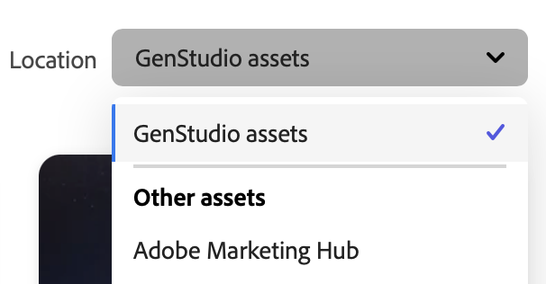

# Verwalten von Assets und Erlebnissen

Adobe GenStudio for Performance Marketing [!DNL Content] vereinfacht und verbessert die Verwaltung markengenehmigter Assets zur Verwendung und Wiederverwendung in Ihrer Digital-Marketing-Journey.

## [!DNL Content]

In der Galerie wird je nach ausgewählter Ansicht ein Inventar der bestätigten Assets, Erlebnisse oder Vorlagen angezeigt. Mit dem Filter-Symbol (Trichter) über der linken Seite der Tabelle wird das Menü **[!UICONTROL Filter]** geöffnet, in dem Sie aus vielen Kategorien auswählen können, um den in der Galerie angezeigten Inhalt zu filtern. Assets Klicken Sie in der Ansicht ]_0} auf das Suchsymbol (Lupe), um ein Keyword zum Suchen eines Assets zu verwenden._[!UICONTROL 

Im Folgenden sehen Sie eine Suche nach dem Begriff `dog` in der Galerie [!UICONTROL Assets]:

### Durchsuchen von Inhalt

Die Filter- und Suchoberfläche ist schnell und reaktionsschnell und bietet ein produktives „Search-First“-Erlebnis. Jede [!DNL Content] bietet Filteroptionen, mit denen Sie Ihre Suche nach dem idealen Asset, Erlebnis oder einer Vorlage eingrenzen können. Für Assets und Erlebnisse können Sie eine Kampagne und bestimmte Richtlinien auswählen, z. B. für Inhalte, die für ein bestimmtes Produkt erstellt wurden.

Es gibt Filter, die auf [Keywords](asset-details.md#user-defined-metadata) und [Attributkategorien](/help/user-guide/insights/attribute-category.md) basieren, um Suchergebnisse einzugrenzen. Vielleicht möchten Sie zum Beispiel ein Asset eines bestimmten Dateityps oder Betreffs suchen, um ein neues Erlebnis für Ihre Kampagne zu erstellen. Oder Sie können Inhalte nach Ihrem Benutzernamen oder dem Namen eines Team-Mitglieds filtern:

- **[!UICONTROL Hochgeladen von]** begrenzt die _[!UICONTROL Assets]_-Liste so, dass nur die Assets angezeigt werden, die von Ihnen oder einer bestimmten Person hochgeladen wurden.
- **[!UICONTROL Erstellt von]** begrenzt die Liste _[!UICONTROL Erlebnisse]_ auf die Erlebnisse, die von Ihnen oder einer bestimmten Person erstellt wurden.

**So suchen Sie nach wiederzuverwendenden Inhalten**:

1. Wählen Sie in _[!DNL Content]_den Abschnitt **[!UICONTROL Assets]**aus.

1. Wählen Sie ein Asset-Repository aus der **[!UICONTROL Speicherort]**-Liste aus oder stellen Sie sicher, dass Sie das richtige Asset-Repository verwenden. `GenStudio assets` ist das Standard-Repository.

   >[!IMPORTANT]
   >
   >Die _Speicherort_-Liste ist nur verfügbar, wenn Sie [eine Verbindung zu einem AEM-Repository herstellen](connect-aem-repo.md).

1. Klicken Sie **[!UICONTROL Suche]** (Lupe), um ein Keyword oder eine Beschreibung einzugeben.

1. Grenzen Sie Ihre Suche ein, indem Sie eine Kategorie aus der Liste _[!UICONTROL Filter]_ auswählen. Wenn Sie beispielsweise nach einer PNG-Datei suchen, klicken Sie auf **[!UICONTROL Dateiformat]** und wählen Sie **PNG**.

   Je enger Sie Ihre Suche eingrenzen, desto weniger Filteroptionen stehen zur Verfügung. Klicken Sie auf **[!UICONTROL Alle löschen]**, um alle Filter zu entfernen.

1. Wählen Sie ein Asset für eine vollständige Ansicht und eine Liste mit Details aus.

   Klicken Sie **[!UICONTROL Herunterladen]** (Abwärtspfeil), um das Asset auf Ihrer lokalen Workstation zu verwenden.

### Speicherort

Standardmäßig werden Assets, die Sie [!DNL Content] über den [!DNL Create] oder durch Hochladen hinzufügen, im `GenStudio assets`-Repository gespeichert. Das `GenStudio assets`-Repository ist ein Lese-/Schreib-Repository in GenStudio for Performance Marketing. Das bedeutet, dass Sie Assets im `GenStudio assets`-Repository speichern, bearbeiten und löschen können.

In der **[!UICONTROL Speicherort]**-Liste über der _[!UICONTROL Assets]_-Galerie auf der rechten Seite können Sie aus verbundenen Adobe Experience Manager (AEM)-[!DNL Assets Content Hub]-Repositorys auswählen.

{width="350"}

Wenn Sie ein AEM-Repository auswählen, zeigt die Galerie ein Inventar der Assets aus diesem Repository an, sodass Sie genehmigte Assets aus diesen Repositorys als Eingaben für die Inhaltserstellung nutzen können. Die Filteroptionen ändern sich entsprechend den in [!DNL AEM Assets Content Hub] konfigurierten Kategorien.

AEM Anleitungen [ Hinzufügen Ihres-Repositorys ](connect-aem-repo.md) GenStudio for Performance Marketing finden Sie unter „Verbinden eines [!DNL AEM Assets Content Hub]-Repositorys“.

Das AEM-Repository ist schreibgeschützt, d. h. Sie können auf den Inhalt zugreifen, aber keine Entwürfe, neuen Assets oder Metadaten im AEM-Repository speichern. Alle Entwürfe und endgültigen Aktualisierungen für Assets, Erlebnisse und Vorlagen werden mit neuen [Systemmetadaten“ im `GenStudio assets`-Repository ](asset-details.md#system-metadata).

{{note-aem-assets}}

Ein AEM-Repository kann bestimmte Lizenzanforderungen durchsetzen, z. B. den Ablauf von Assets. Diese Assets sind möglicherweise nicht für die Verwendung in [!DNL Create]-Workflows verfügbar. Abgelaufene Assets müssen möglicherweise erneuert oder ersetzt werden, um die Kontinuität Ihrer Projekte zu wahren. Wenden Sie sich an Ihren [!DNL AEM Assets Content Hub]-Administrator, um Unterstützung zu diesen Assets zu erhalten.

## Verwaltung von Assets

In [!UICONTROL Content] können Sie Ihre digitalen Assets einfach speichern, abrufen und verwalten. Durch die Nutzung sowohl des `GenStudio assets`-Repositorys als auch der AEM-Repositorys können Sie sicherstellen, dass Ihre Assets gut organisiert sind und für verschiedene Marketing-Kampagnen zugänglich sind. Dieser Ansatz mit mehreren Repositorys bietet Flexibilität und Kontrolle über die Asset-Nutzung in allen Umgebungen, sodass nur genehmigte und aktuelle Assets für die Marketing-Maßnahmen verwendet werden.

In der folgenden Tabelle sind die für Assets, Erlebnisse und Vorlagen verfügbaren Verwaltungsaufgaben aufgeführt:

| Aufgaben | Assets | Erlebnisse | Vorlagen |
| --------------------------------------------------------- | :----: | :---------: | :-------: |
| [Details anzeigen](/help/user-guide/content/asset-details.md) | ✓ | ✓ | ✓ |
| [Erlebnis erstellen](/help/user-guide/create/overview.md) |        |             | ✓ |
| [Im Adobe Expreß bearbeiten](#edit-in-express) | ✓ |             |           |
| [Zur Aktivierung exportieren](#export-for-activation) |        | ✓ |           |
| [Aktualisieren](/help/user-guide/content/use-templates.md#refresh-template) |   |      | ✓ |
| [Download](#download-assets) | ✓ |             | ✓ |
| [Löschen](#delete-assets) | ✓ | ✓ | ✓ |

### Hinzufügen von Assets

Beim Hinzufügen von Assets zu [!DNL Content] werden diese standardmäßig im `GenStudio assets`-Repository gespeichert. Die Schaltfläche _[!UICONTROL Assets hinzufügen]_ ist nur verfügbar, wenn _[!UICONTROL Speicherort]_ das `GenStudio assets`-Repository ist.

{width="350"}

**Hinzufügen von Assets**:

1. Klicken Sie _[!DNL Content]_auf **[!UICONTROL Assets hinzufügen]**.

1. Legen Sie in _Ansicht „Genehmigte Assets hinzufügen_ eine oder mehrere Dateien im Ablagebereich ab. Optional können Sie mit „Durchsuchen“ aus lokalen Dateien **[!UICONTROL oder]** Dateien von Dropbox oder Microsoft OneDrive importieren.

1. Wählen Sie im _Details hinzufügen_ einen **[!UICONTROL Kampagnennamen]** oder geben Sie einen neuen Namen ein.

1. Um die Auffindbarkeit zu verbessern, fügen Sie optionale Details wie _Markenname_, _Personas_, _Region_ und _Keywords_ in den Abschnitt **Weitere Details** ein.

   Je mehr Details Sie angeben, desto zuverlässiger werden die Funktionen von GenStudio for Performance Marketing. Wählen Sie ein oder mehrere Details aus der Liste aus oder geben Sie gegebenenfalls ein neues ein, z. B. mit Schlüsselwörtern. Jedes hinzugefügte Detail wird unter der Liste angezeigt. Klicken Sie auf **`x`** , um ein Detail zu entfernen.

   Alle Details, die Sie hinzufügen, gelten für alle in dieser Aktion hinzugefügten Assets.

   Siehe [Metadatendetails](/help/user-guide/content/asset-details.md#system-metadata).

1. Klicken Sie **[!UICONTROL Assets hinzufügen]**.

1. Klicken Sie nach Abschluss des Asset-Uploads auf **Fertig**.

1. Um Ihre neu hochgeladenen Assets anzuzeigen, klicken Sie auf **[!UICONTROL Aktualisieren]** in der Benachrichtigung _Neue Assets verfügbar_ unten auf der Arbeitsfläche.

### Herunterladen von Assets

**Herunterladen eines Assets**:

1. Wählen Sie _[!DNL Content]_ein Asset oder eine Vorlage aus. Durch Klicken auf ein Asset wird eine zielgerichtete Ansicht des Assets geöffnet.

1. Klicken Sie in der Asset **[!UICONTROL Ansicht oben rechts auf das Symbol]** Herunterladen“ (Pfeil nach unten).

1. Beim Download wird eine Kopie des Assets an Ihrem standardmäßigen Download-Speicherort abgelegt.

### Löschen von Assets

**So löschen Sie ein Asset**:

1. Wählen Sie _[!DNL Content]_ein Asset, ein Erlebnis oder eine Vorlage aus. Durch Klicken auf ein Asset wird eine zielgerichtete Ansicht des Assets geöffnet.

1. Klicken Sie in der Asset **[!UICONTROL Ansicht oben]** auf „Löschen“ (Papierkorb).

1. Überprüfen Sie im Popup _Asset löschen_ das Asset und klicken Sie auf **[!UICONTROL Löschen]**.

## Zur Aktivierung exportieren

Sie können genehmigte Erlebnisse zur Aktivierung in einem Format exportieren, das mit Ihrem Zielkanal kompatibel ist.

**Ein Erlebnis exportieren**:

1. Wählen Sie _[!DNL Content]_ein Erlebnis aus. Durch Klicken auf ein Erlebnis wird die Detailansicht geöffnet oder auf das Kontextmenü (`...`) geklickt.

1. Klicken Sie auf **[!UICONTROL Zur Aktivierung exportieren]** (Feld mit einem Pfeil nach oben).

1. Wählen _im Popup_ Zur Aktivierung exportieren“ eines der verfügbaren Formate aus:

   - E-Mail: `HTML`, `CSV`
   - Meta- und Display-Anzeigen: `HTML`, `JPEG`, `PNG`

Siehe [Aktivierung](/help/user-guide/activation/overview.md).

## In Express bearbeiten

Sie können Bild-Assets (JPG oder PNG) mit dem Adobe Expreß direkt in GenStudio for Performance Marketing bearbeiten. Die _[!UICONTROL Powered by Adobe Expreß]_-Arbeitsfläche bietet praktische Funktionen, um Ihre Bilder zu verbessern, ohne das GenStudio-Programm verlassen zu müssen. Sie können auf einfache Weise Hintergründe entfernen, generative Füllungen anwenden, Effekte anpassen und Bilder zuschneiden.

>[!BEGINSHADEBOX]

Kriterien für die Optimierung von Bildern mit der [!DNL Edit in Adobe Express]:

- Zu den unterstützten MIME-Typen gehören `image/png` und `image/jpeg`
- Die minimalen Bildabmessungen betragen 50x50 Pixel
- Die maximalen Bildabmessungen betragen 8000 x 8000 Pixel
- Die maximale Größe beträgt 40 MB (40.000.000 Byte)

>[!ENDSHADEBOX]

**So bearbeiten Sie ein Asset mit Express**:

1. Wählen Sie _[!DNL Content]_ein Bild-Asset aus. Durch Klicken auf ein Asset wird eine zielgerichtete Ansicht des Assets geöffnet.

1. Klicken Sie in der Asset **[!UICONTROL Ansicht oben rechts auf]** Symbol „Bearbeiten im Adobe Expreß&quot;.

1. Verwenden Sie auf der _[!UICONTROL Powered by Adobe Expreß]_-Arbeitsfläche die Express-Steuerelemente im linken Bereich, um Ihr Bild zu verbessern.

1. Wenn Sie mit dem aktualisierten Bild zufrieden sind, klicken **[!UICONTROL oben rechts auf]** Kopie speichern“.

1. Wählen Sie das Dateiformat JPG oder PNG aus und klicken Sie auf **[!UICONTROL Kopie speichern]**.

1. Aktualisieren _[!UICONTROL im Popup Kopie des Assets]_ den **[!UICONTROL Asset-Namen]**.

   - Wählen Sie **[!UICONTROL Wie Original-Asset]** aus, um die Asset-Details auf das neue Bild zu übertragen.

   - Erweitern Sie den Abschnitt **[!UICONTROL Weitere Details]**, um die Richtlinien und andere Metadaten zu aktualisieren.

   >[!TIP]
   >
   >Je mehr Details Sie angeben, desto zuverlässiger werden die Funktionen von GenStudio for Performance Marketing. Wählen Sie ein oder mehrere Details aus der Liste aus oder geben Sie gegebenenfalls ein neues ein, z. B. mit Schlüsselwörtern. Jedes hinzugefügte Detail wird unter der Liste angezeigt. Klicken Sie auf **`x`** , um ein Detail zu entfernen.

1. Klicken Sie auf **[!UICONTROL Speichern]**.
