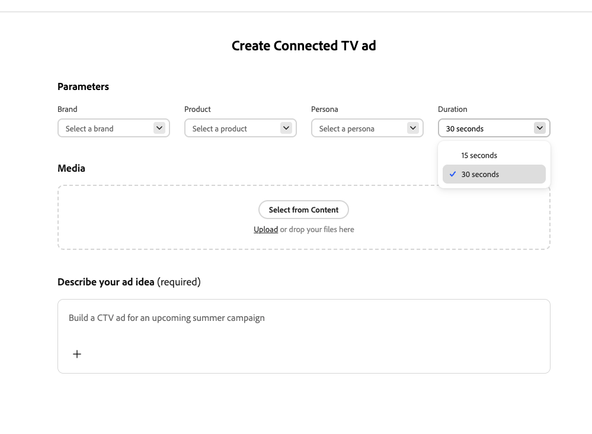

# Erstellen eines vernetzten TV-Erlebnisses

Verwenden Sie [[!DNL Create]](/help/user-guide/create/overview.md) in [!DNL GenStudio for Performance Marketing], um Anzeigen für vernetztes Fernsehen (CTV) an einem Ort zu erstellen - von kurzen und freigegebenen Richtlinien über die Generierung, szenenbasierte Verfeinerung, Genehmigung und den Export für den Publisher. Der folgende Workflow wird vollständig in [!DNL GenStudio for Performance Marketing] ausgeführt. Es gibt keine separate CTV-App oder Publisher-Einbettung.

## Voraussetzungen

Bevor Sie eine CTV-Anzeige erstellen, bestätigen Sie Folgendes:

* Sie haben Zugriff auf [!DNL GenStudio for Performance Marketing].
* **[!DNL Brands]**, **[!DNL Products]** und **[!DNL Personas]** als freigegebene Objekte in [!DNL GenStudio for Performance Marketing] konfiguriert. Unter [Richtlinien - Übersicht](/help/user-guide/guidelines/overview.md) erfahren Sie, wie diese Objekte die Generierung beeinflussen.
* Campaign-Assets (Videoclips, Bilder, Logos, Musik) werden empfohlen, sind aber nicht erforderlich. Generative KI kann Lücken füllen, wenn Assets fehlen oder unvollständig sind.

## Neue CTV-Anzeige erstellen

Alles in diesem Workflow geschieht in [!DNL GenStudio for Performance Marketing].

{width="50%"}
**Navigieren Sie zur CTV-Erstellung**:

1. Melden Sie sich bei [!DNL GenStudio for Performance Marketing] an.
1. Navigieren Sie auf der Startseite oder der Erstellungsoberfläche zu **[!UICONTROL Erstellen]**.
1. Wählen Sie **CTV** mithilfe der Karte CTV-Erstellung aus.
1. Klicken Sie **[!UICONTROL CTV-Anzeige erstellen]**.

Ein zentrales, optimiertes Erlebnis bei der CTV-Erstellung wird geöffnet. Es ist nicht erforderlich, zuerst einen Anzeigentyp auszuwählen.

## Konfigurieren der Zusammenfassung

Die Zusammenfassung und die Eingaben bestimmen, wie die Anzeige generiert wird. Dies ist Ihre Möglichkeit, Kontext und Einschränkungen für den Prozess der Anzeigengenerierung anzugeben.

{width=80%&quot; align=„center“}

**So konfigurieren Sie die Zusammenfassung**:

1. Wählen Sie **[!DNL Brands]**, **[!DNL Products]** und **[!DNL Personas]** aus Ihren vorhandenen freigegebenen Objekten aus.
1. Fügen Sie den **Creative Brief“**, indem Sie ihn direkt eingeben oder hochladen. Geben Sie das Kampagnenziel, die Hauptbotschaft und alle Begrenzungen an.
1. Stellen Sie **Anzeigendauer** auf 15 Sekunden oder 30 Sekunden ein.
1. Fügen Sie optional **Assets“**. Laden Sie Videoclips, Bilder, Logos, Musik, VoiceOver oder Intro-/Outro-Karten hoch (Drag-and-Drop oder Dateiauswahl) oder wählen Sie Assets aus Ihrem [!DNL Content]-Repository aus.
1. Klicken Sie auf die **[!UICONTROL Generieren]**-Schaltfläche.

Wenn Assets fehlen oder unvollständig sind, können [!DNL GenStudio for Performance Marketing] mithilfe von KI fehlende Szenen, Musik oder VoiceOver generieren. Assets, das Sie bereitstellen, hat immer Vorrang vor generiertem Material.

Automatisch [!DNL GenStudio for Performance Marketing]:

* Interpretiert die Zusammenfassung zusammen mit dem Kontext aus **[!DNL Brands]**, **[!DNL Products]** und **[!DNL Personas]**.
* Stellt eine vollständige CTV-Anzeigenstruktur zusammen.
* Erstellt nach Bedarf Szenen, Textüberlagerungen, Musik und VoiceOver.
* Wendet die Dauer und Formatierung gemäß CTV an.

Das Ergebnis ist eine vollständig geformte, vorschaubare CTV-Anzeige - keine bloße Entwurfszeitleiste.

## Bearbeiten und Verfeinern der Anzeige

Verwenden Sie den Scene-Based-Editor, um die Anzeige zu verfeinern, ohne alles neu zu generieren.

Klicken Sie auf eine Szene in der Szenenleiste, um sie zur Bearbeitung zu öffnen. Zu den Bearbeitungen, die Sie durchführen können, gehören:

* Ersetzen oder regenerieren Sie eine einzelne Szene mit KI.
* Bearbeiten Sie die Szenenaufforderung, um Varianten zu erstellen.
* Szenen neu anordnen oder trimmen.
* Bearbeiten von Textüberlagerungen.
* Tauschen, Stummschalten oder Ersetzen von Musik und VoiceOver.
* Anpassen von Übergängen zwischen Szenen.

Die Bearbeitung erfolgt im Umfang, sodass Sie jeweils nur eine Szene regenerieren können, um die Iteration und kreative Aktualisierung zu beschleunigen.

>[!NOTE]
>
>Der Editor unterstützt nicht das Ändern von Objekten *innerhalb* eines Videoclips (z. B. das Entfernen von Elementen, das Ändern der Produktfarben oder das Ändern des Aussehens von Personen).

## Überprüfen und genehmigen

Senden Sie die Anzeige zur Markenüberprüfung mithilfe Ihrer integrierten Genehmigungs-Workflows. Prüfer für Marken und Stakeholder prüfen Messaging, Visualisierung und Markenkonformität. Genehmigende Personen validieren die Anzeige. Es wird nicht erwartet, dass sie anstelle des Marketing-Experten eine Videobearbeitung durchführen.

## Export

Nach der Genehmigung haben Sie folgende Möglichkeiten:

* Exportieren Sie die fertige CTV-Anzeige in ein für den Publisher geeignetes, konformes Format.
* Speichern Sie die Anzeige wieder in [!DNL Content].
* Verwenden Sie sie in nachgelagerten Workflows zum Kaufen und Verteilen von Fernsehsendungen.

Creative soll Aktivierungsbereit sein, ohne dass eine Neukodierung oder Überarbeitung erforderlich ist.
