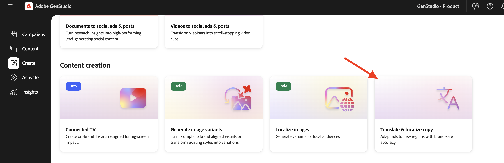

# Übersetzen und Lokalisieren von Erlebnissen

Adobe [!DNL GenStudio for Performance Marketing] bietet eine vordefinierte Übersetzung auf der HTML-Arbeitsfläche, sodass globale und regionale Marketing-Experten genehmigte Erlebnisse ohne Übersetzungs-Tools in mehrere Sprachen skalieren können.

Die Funktion verwendet standardmäßig Azure Open AI . Ihr Unternehmen kann auch über „Übersetzungserweiterungen“ eine Verbindung [&#x200B; bevorzugten Übersetzungsdienst &#x200B;](/help/extensibility/deploy-app.md#find-translation-extensions).

Die Übersetzung beginnt mit einem genehmigten Erlebnis, das in [!DNL Content] gespeichert wurde. Das Quellerlebnis kann in jeder Sprache verfügbar sein. Jede übersetzte Variante wird auf der [!DNL Create]-Arbeitsfläche als bearbeitbarer Entwurf geöffnet, den Sie exportieren, zur Überprüfung senden und als separates Erlebnis veröffentlichen können.

## Unterstützte Erlebnisse

Vorkonfigurierte Übersetzungen auf der HTML-Arbeitsfläche unterstützen:

* [E-Mail-Erlebnisse](/help/user-guide/create/email-experiences.md)
* Bezahlte Medienerlebnisse, einschließlich [Meta](/help/user-guide/create/meta-experiences.md), [LinkedIn](/help/user-guide/create/linkedin-experiences.md) und [Display](/help/user-guide/create/display-ad-experiences.md) Anzeigen

## Bevor Sie beginnen

Bestätigen Sie, dass das zu übersetzende Erlebnis **genehmigt** und in der [!DNL Content] (Erlebnisse _[!UICONTROL verfügbar]_. Erlebnisse für Entwürfe oder laufende Überprüfungen sind keine geeigneten Übersetzungsquellen.

Wenn Ihr Unternehmen eine benutzerdefinierte Übersetzungserweiterung registriert, verwendet GenStudio for Performance Marketing diesen Service anstelle der standardmäßigen Azure Open AI-Übersetzung. Siehe [Suchen von Übersetzungserweiterungen](/help/extensibility/deploy-app.md#find-translation-extensions).

## Aus [!DNL Create] übersetzen {#translate-from-create}

Starten Sie eine Übersetzung von der [!DNL Create] Landingpage aus, um ein genehmigtes Erlebnis zu lokalisieren.

{width="600" zoomable="yes"}

**Aus[!DNL Create]** übersetzen:

1. Scrollen Sie [!DNL Create] zum Abschnitt _Inhaltserstellung_ .
1. Klicken Sie auf **[!UICONTROL Kopie übersetzen und lokalisieren]**.
1. Wählen Sie die genehmigte E-Mail- oder Paid-Media-Version aus, die Sie übersetzen möchten. Klicken Sie auf **[!UICONTROL Verwenden]**-Schaltfläche.
1. Wählen Sie in der Liste der unterstützten Sprachen die Zielsprachen aus. Klicken Sie auf **[!UICONTROL Übersetzen]**.

Übersetzte Varianten werden auf der Arbeitsfläche angezeigt.

## Aus [!DNL Content] übersetzen {#translate-from-content}

Sie können die Übersetzung auch [!DNL Content] starten, wenn Sie genehmigte Erlebnisse durchsuchen.

### In der Erlebnisgalerie

{width="500" zoomable="yes"}

**Aus der Erlebnisgalerie zu übersetzen**:

1. Öffnen Sie in [!DNL Content] die Registerkarte **[!UICONTROL Erlebnisse]** .
1. Suchen Sie das genehmigte Erlebnis, das Sie übersetzen möchten.
1. Klicken Sie auf der Erlebniskarte auf das Menü „Optionen“ (drei Punkte).
1. Klicken Sie auf **[!UICONTROL Übersetzen]**.
1. Wählen Sie in der Liste der unterstützten Sprachen die Zielsprachen aus. Klicken Sie auf **[!UICONTROL Übersetzen]**.

## Arbeiten mit Übersetzungen auf der Arbeitsfläche

Auf der HTML-Arbeitsfläche kann das Quellerlebnis nicht bearbeitet werden, da es bereits genehmigt ist. E-Mail-Quellerlebnisse werden gesperrt angezeigt. Sie können Text in übersetzten Varianten direkt auf der Arbeitsfläche bearbeiten. Anleitungen [&#x200B; Bearbeiten von Variantenkopien finden Sie unter &#x200B;](/help/user-guide/create/manage-variants.md)Verwalten von Varianten“.

Bei übersetzten Erlebnissen wird keine Markenvalidierung durchgeführt oder ein Markenwert angezeigt. Das Quellerlebnis wurde bereits mit Markenrichtlinien erstellt, geprüft und genehmigt.

Die Fragmentregeneration wird für übersetzte Erlebnisse nicht unterstützt.

### Löschen einer übersetzten Sprache

**So entfernen Sie eine übersetzte Sprache von der Arbeitsfläche**:

1. Klicken Sie auf der Arbeitsfläche [!DNL Create] auf das Menü Optionen (drei Punkte) in der Überschrift Übersetzte Variante.
1. Klicken Sie auf **[!UICONTROL Löschen]**.

{width="500" zoomable="yes"}

Die übersetzte Sprache wird aus der Arbeitsfläche entfernt.

### Paid-Media-Übersetzung aktualisieren

Nachdem Sie die übersetzte bezahlte Medienkopie bearbeitet haben, können Sie die ursprüngliche Übersetzungsausgabe neu laden.

**So aktualisieren Sie eine Paid-Media-Übersetzung**:

1. Öffnen Sie auf der Arbeitsfläche [!DNL Create] das Optionsmenü für die bearbeitete übersetzte Variante.
1. Klicken Sie **[!UICONTROL Übersetzung aktualisieren]**.

>[!NOTE]
>
>Für gebührenpflichtige Medienerlebnisse ist eine aktualisierte Übersetzung verfügbar. Die E-Mail-Übersetzung unterstützt derzeit keine Übersetzung zur Aktualisierung.

## Exportieren, Überprüfen und Veröffentlichen

Nachdem Übersetzungen auf die Arbeitsfläche geladen wurden, können Sie sie exportieren, zur Genehmigung senden und genehmigte Varianten in [!DNL Content] veröffentlichen.

**So exportieren Sie übersetzte Erlebnisse**:

1. Klicken Sie auf der Arbeitsfläche [!DNL Create] in **[!UICONTROL Symbolleiste auf]** Exportieren“.
1. Exportformat auswählen.
   * E-Mail **(CSV und Bilder** oder nur **HTML**
   * Bezahlte Medien: **CSV + JPG**, **CSV + PNG** oder **HTML + Images**
1. Klicken Sie auf **[!UICONTROL Exportieren]**.

Sie können auch [Erlebnisse aus exportieren [!DNL Content]](/help/user-guide/content/manage-assets.md#export-experiences).

**Um Überprüfung und Genehmigung anzufordern**:

1. Klicken Sie auf der Arbeitsfläche [!DNL Create] auf **[!UICONTROL Genehmigung anfordern]**.
1. Weisen Sie mindestens eine genehmigende Person zu und senden Sie die Anfrage.

Siehe [Überprüfung und Genehmigung anfordern](/help/user-guide/approvals/request-review.md) für Details zum Überprüfungs-Workflow.

**Veröffentlichung genehmigter Übersetzungen**:

1. Nachdem die genehmigenden Personen die übersetzten Varianten genehmigt haben, klicken Sie auf **[!UICONTROL Veröffentlichen]**.
1. Bestätigen Sie im Veröffentlichungsfenster die Metadaten wie Kampagnenname, Zeitrahmen, Regionen und Schlüsselwörter.

Siehe [Genehmigte Inhalte veröffentlichen](/help/user-guide/approvals/publish-content.md).

Jede veröffentlichte Übersetzung wird in [!DNL Content] als separates Erlebnis gespeichert.

## Übersetzte Erlebnis-Metadaten

Veröffentlichte Übersetzungen enthalten Metadaten, die jede Variante mit ihrer Quelle verknüpfen, darunter:

* **Titel** - folgt dem Muster `Translation from "<source title>" <channel>`, z. B. `Translation from "Summer campaign" Meta`
* **Erstellt von** - der Benutzer, der die Übersetzung initiiert hat
* **Erstellungsdatum** - das Datum der Übersetzung
* **Übersetzte Quelle** - ein Link zum Quellerlebnis in [!DNL Content]
* **Übersetzt aus** - die Ausgangssprache

## Einschränkungen

Beachten Sie beim Übersetzen von Erlebnissen auf der HTML-Arbeitsfläche die folgenden Einschränkungen:

* Das Quellerlebnis muss bereits genehmigt und in [!DNL Content] gespeichert sein.
* Die Markenvalidierung wird nicht auf übersetzten Varianten ausgeführt.
* Die Fragmentregeneration wird in übersetzten Erlebnissen nicht unterstützt.
* Übersetzung aktualisieren ist nur für bezahlte Medien verfügbar.

## Verwandte Informationen

* [E-Mail-Erlebnisse](/help/user-guide/create/email-experiences.md)
* [Meta-Erlebnisse](/help/user-guide/create/meta-experiences.md)
* [Anzeigen-Erlebnisse](/help/user-guide/create/display-ad-experiences.md)
* [Verwalten von Assets und Erlebnissen](/help/user-guide/content/manage-assets.md)
* [Suchen von Übersetzungserweiterungen](/help/extensibility/deploy-app.md#find-translation-extensions)
