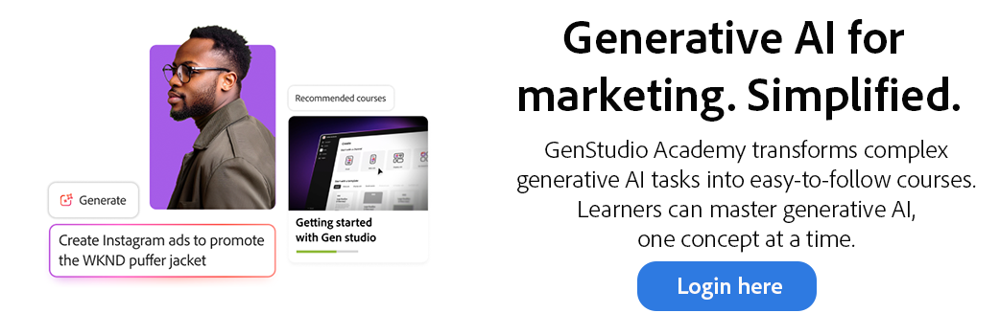

# GenStudio Academy

<table>

 <tr style= "border: 0;">

  <td> <strong style= "font-size: 2em">Erhöhen Sie Ihr KI-Wissen im Allgemeinen.  </strong>
Master der generativen KI-Fähigkeiten, um Ihre Kreativ- und Marketing-Workflows zu transformieren. 
<a href="https://learningmanager.adobe.com/accountiplogin?ipId=16970&amp;accesskey=c4988oojirhb5" rel="noreferrer" target="_blank" class="spectrum-Button spectrum-Button--fill spectrum-Button--accent spectrum-Button--sizeM">Registrieren</a>          <a href="https://genstudioacademy.adobelearningmanager.com/" rel="noreferrer" target="_blank" class="spectrum-Button spectrum-Button--fill spectrum-Button--accent spectrum-Button--sizeM">Anmelden</a></td>

  <td></td>

 </tr>

</table>

<table>

 <tr style= "border: 0;">

  <td align="center">

    <strong style= "font-size: 2em"> Master generative KI bei der GenStudio Academy.</strong>
Einzigartige Fähigkeiten für die Integration generativer KI in kreative und Marketing-Workflows - jederzeit, überall und vollständig kostenlos.

  </td>

 </tr>

</table>

>[!BEGINSHADEBOX]

<table>

 <tr style= "border: 0;">

  <td></td>

  <td align="center"> <strong style= "font-size: 2em">Generative KI für das Marketing. Vereinfacht.</strong>
 GenStudio Academy wandelt komplexe generative KI-Aufgaben in leicht verständliche Kurse um, wie etwa die Umwandlung von Markenrichtlinien. Mithilfe herunterladbarer Handbücher und Videos können Lernende generative KI, jeweils ein Konzept, beherrschen.
<a href="https://learningmanager.adobe.com/accountiplogin?ipId=16970&amp;accesskey=c4988oojirhb5" rel="noreferrer" target="_blank" class="spectrum-Button spectrum-Button--fill spectrum-Button--accent spectrum-Button--sizeM">Jetzt erkunden</a></td>

 </tr>

</table>

>[!ENDSHADEBOX]

<table>

 <tr style= "border: 0;">

  <td align="center"> <strong style= "font-size: 2em"> Lernstufen. Unbeschränkte Gelegenheit entsperrt.</strong>
Mit den Master-Levels der GenStudio Academy ist es einfach, Inhalte zu finden, die Ihre generativen KI-Fähigkeiten steigern - ob Sie über LLMs lernen, die schnelle Erstellung meistern oder KI-Tools in Aktion sehen. Die GenStudio Academy hat für jeden etwas.</td>

  <td></td>

 </tr>

</table>

<table>

    <tr style="border: 0;">

        <td colspan="3">

            <strong style="font-size: 2em;">In Kürze verfügbar</strong>

        </td>

    </tr>

    <tr style="border: 0;">

        <td align="center">

            

            

                <strong>Tipps und Tricks</strong>

            

            
Tipps und Tricks zur optimalen Verwendung von GenStudio for Performance Marketing.

        </td>

        <td align="center">

            

            

                <strong>Soziales Lernen</strong>

            

            
Lernen Sie von Ihren Kollegen und teilen Sie Ihr Wissen in Ihrem Unternehmen auf einfache Weise.

        </td>

        <td align="center">

            

            

                <strong>Expertenkurse</strong>

            

            
Fortgeschrittene Kurse zur Erschließung von KI-Kompetenzen auf Expertenebene im Marketing.

        </td>

    </tr>

</table>

>[!BEGINSHADEBOX]

<table>

    <tr></tr>

    <tr style="border: 0;">

        <td>

            

        </td>

        <td>

            <strong style="font-size: 3em">Bringen Sie Ihre Lernergebnisse in die Praxis.</strong>

            
Erkunden Sie GenStudio for Performance Marketing, eine generative KI-First-Anwendung, mit der Marketingteams eigene Anzeigen und E-Mails erstellen können, um wirkungsvolle, personalisierte Marketingkampagnen zu erzielen.

            

                <a href="https://business.adobe.com/products/genstudio-for-performance-marketing.html" rel="noreferrer" target="_blank" class="spectrum-Button spectrum-Button--fill spectrum-Button--accent spectrum-Button--sizeM">

                    Bring mich dorthin

                </a>

            

        </td>

    </tr>

    <tr></tr>

</table>

>[!ENDSHADEBOX]
