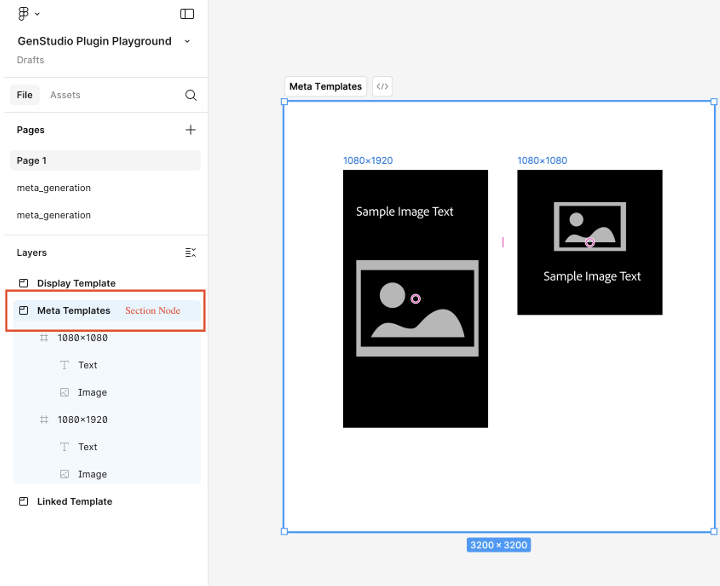

# Figma-Plug-in für GenStudio for Performance Marketing

Das GenStudio for Performance Marketing Figma-Plug-in fügt dem Figma-Programm ein neues Bedienfeld hinzu, mit dem Sie markeninterne Inhalte generieren können.
[Finden und installieren Sie das Plug-in vom Figma Community Marketplace](https://www.figma.com/community/plugin/1604251370122180013/firefly-enterprise-and-genstudio).

Auf dieser Seite wird beschrieben, wie Sie das Plug-in konfigurieren und verwenden.

Zu den Funktionen dieses Plug-ins gehören:

* Ordnen Sie Figma-Textelemente GenStudio for Performance Marketing-Feldern zu, z. B. `headline`, `body`, `on_image_text` und mehr.
* Erstellen Sie neue markeninterne Meta-, LinkedIn- oder Display-[!DNL Experiences] basierend auf einer Marken-, Personen-, Produkt- und Textaufforderung.
* Erstellen Sie [!DNL Experiences] direkt im Figma-Dokument, indem Sie den Text in den zugeordneten Figma-Elementen durch die von GenStudio for Performance Marketing generierten Werte ersetzen.
* Vorhandene Inhalte je nach Aufforderung umformulieren, verkürzen, verlängern oder übersetzen.
* Generierte [!DNL Experiences] in mehrere Sprachen übersetzen.
* Exportieren Sie generierte [!DNL Experiences] als reduzierte Bilder in eine lokale Quelle.
* Exportieren Sie generierte [!DNL Experiences] nach GenStudio for Performance Marketing.
* Verwenden Sie Plug-in-Optionen, die sich an die ausgewählten Elemente auf der Figma-Arbeitsfläche anpassen.

>[!VIDEO](https://video.tv.adobe.com/v/3478809?learn=on)

## Erstellen einer Vorlage

Das Plug-in erfordert die ersten beiden Ebenen Ihres Figma-Dokuments, um dieser Konvention zu folgen:

* **Abschnitt** - Stellt das übergeordnete Projekt dar, das mehrere Vorlagen enthalten kann.
* **Frame** - Stellt eine Vorlage in einem Projekt dar. Die Vorlage kann mit Text, Bildern, Komponenten und anderen Elementen gefüllt werden.

### Meta-Vorlagen

Diese Vorlagengrößen werden unterstützt:

Für Instagram- oder Facebook-Posts:

* Breite: 1080 px (fest)
* Höhe: 1080 px oder 1350 px

Für Instagram- oder Facebook-Stories:

* Breite: 1080 px (fest)
* Höhe: 1920 px

Das -Plug-in bestimmt das Chrom des generierten Erlebnisses anhand der Höhe der Vorlage.

### Vorlagen anzeigen

Es gibt keine Anforderung für eine feste Größe. Anzeigevorlagen unterstützen jede Größe.

### LinkedIn-Vorlagen

* Breite: 1200 px (fest)
* Höhe: 1200 px, 628 px, 2292 px, 1800 px oder 1500 px

### Zuordnung der Feldrolle

Das Plug-in muss die verschiedenen Elemente Ihrer Vorlage verstehen, z. B. Überschrift, Haupttext oder Bild.

So weisen Sie Elementrollen zu:

1. Wählen Sie ein Element in Ihrer Vorlage aus (Text, Bild usw.)
1. Verwenden Sie das Dropdown-Menü, um eine Rolle zuzuweisen.

Das -Plug-in speichert diese Zuordnungen, um sie für generierte Inhalte zu verwenden. Ein Feld „role“ kann mehreren Vorlagenelementen zugeordnet werden.

{width="60%"}

### Ausnahmen bei der Feldzuordnung

{{$include /help/_includes/field-mapping-exceptions.md}}

## Neuen Inhalt generieren

Verwenden Sie GenStudio for Performance Marketing AI, um Elemente in Figma-Vorlagen zu generieren oder zu variieren.

1. Wenn Sie das GenStudio Plug-in Playground oder bereits vorbereitete Vorlagen verwenden, wählen Sie den Abschnittsknoten aus, der Ihre Anzeigenvorlagen enthält. Sie können dies über das Bedienfeld **Ebenen** oder durch direktes Klicken auf den Bereich auf der Arbeitsfläche tun.
   {width="50%" zoomable="yes"}
1. Geben Sie im Plug-in-Fenster einen Projektnamen für die Varianten ein, wählen Sie eine Plattform für den Inhalt aus und füllen Sie die anderen erforderlichen Informationen aus. Klicken Sie anschließend auf **[!UICONTROL Setup beenden]**.
   {width="30%" zoomable="yes"}
1. Wählen Sie die [!DNL Brand], [!DNL Persona] und [!DNL Product] aus, die für die Inhaltserstellung verwendet werden sollen.
1. Wählen Sie die Anzahl der zu erstellenden Varianten aus (bis zu acht).
1. Verwenden Sie die Schaltfläche unter **[!UICONTROL Inhalt auswählen]**, um Bilder aus Ihren Assets zu suchen und auszuwählen. Die 40 zuletzt hinzugefügten Assets werden zuerst angezeigt, und Sie können nach anderen Assets suchen. Die Größe der ausgewählten Bilder wird automatisch an die Vorlagen angepasst.
1. Geben Sie eine Textaufforderung ein. Für jedes Feld in der **[!UICONTROL Felder]**-Liste ist die Option **[!UICONTROL Aktion]** auf **[!UICONTROL Generieren]** für neue Inhalte festgelegt.
1. Ordnen Sie alle Feldrollen zu. Siehe [Zuordnung von Feldrollen](#field-role-mapping).
1. Klicken Sie auf die **[!UICONTROL Generieren]**-Schaltfläche.

## Übersetzen oder Erstellen und Kopieren von Varianten aus vorhandenen Inhalten

Verwenden Sie GenStudio for Performance Marketing AI, um Anzeigenkopien von Varianten zu generieren oder Figma-Vorlagen zu übersetzen.

1. Wählen Sie den Abschnittsknoten aus, der Ihre Anzeigenvorlagen enthält. Sie können dies über das Bedienfeld **Ebenen** oder durch direktes Klicken auf den Bereich auf der Arbeitsfläche tun.
   {width="50%" zoomable="yes"}
1. Geben Sie im Plug-in-Fenster einen Projektnamen für die Varianten ein und wählen Sie eine Plattform für den Inhalt aus.
1. Wählen **[!UICONTROL unter „Was ist das Ziel?]** die Option **[!UICONTROL Varianten erstellen]** oder **[!UICONTROL Übersetzen]** aus und klicken Sie dann auf die Schaltfläche **[!UICONTROL Setup beenden]**.
   {width="30%" zoomable="yes"}
1. Wählen Sie die [!DNL Brand], [!DNL Persona] und [!DNL Product] aus, die für die Inhaltserstellung verwendet werden sollen.
1. Wählen Sie die Anzahl der zu erstellenden Varianten aus.
1. Verwenden Sie die Schaltfläche unter **[!UICONTROL Inhalt auswählen]**, um Bilder aus Ihren Assets zu suchen und auszuwählen. Die 40 zuletzt hinzugefügten Assets werden zuerst angezeigt, und Sie können nach anderen Assets suchen. Die Größe der ausgewählten Bilder wird automatisch an die Vorlagen angepasst.
1. Geben Sie eine Textaufforderung ein. Für jedes Feld in der **[!UICONTROL Felder]**-Liste ist die Option **[!UICONTROL Aktion]** auf **[!UICONTROL Generieren]** für neue Inhalte festgelegt.
1. Ordnen Sie alle Feldrollen zu. Siehe [Zuordnung von Feldrollen](#field-role-mapping).
1. Wählen Sie jeden Feldtyp aus, um Varianten zu generieren oder zu übersetzen im Bedienfeld auf der linken Seite des Plug-ins und fügen Sie den anfänglichen Inhalt in jedes Feld **[!UICONTROL Anfänglicher Inhalt]** ein.
   {width="60%" zoomable="yes"}
1. Klicken Sie auf die **[!UICONTROL Generieren]**-Schaltfläche.

## Inhalte nach der Erstellung übersetzen

1. Wählen Sie eine Generation aus, die Sie übersetzen möchten.
   {width="20%" zoomable="yes"}
1. Wählen Sie **[!UICONTROL Übersetzung]** aus und klicken Sie dann auf **[!UICONTROL Übersetzen]**.
1. Wählen Sie Ihre Zielsprache(n) aus.
1. Klicken Sie auf **[!UICONTROL Auswählen]**.

Zu den Übersetzungsergebnissen gehören:

* Es wird eine neue Seite mit übersetzten Inhalten angezeigt.
* Jede Übersetzung zeigt die Zielsprache oder das Gebietsschema an.
* Der ursprüngliche Inhalt bleibt auf der Originalseite unverändert.

{width="60%" zoomable="yes"}

## Andere Aktionen für Inhaltsfelder nach der Generierung

Wenn Sie vorhandene Inhalte in einem Feld bearbeiten, werden im Plug-in-Bedienfeld nützliche Optionen angezeigt.

{width="30%" zoomable="yes"}

Sie haben unter anderem folgende Möglichkeiten:

* Ändern Sie den **[!UICONTROL Wert]**, um Text direkt zu ändern. Das Ändern dieses Inhalts gilt automatisch für alle ausgewählten Varianten.
* Die KI kann viele Optionen **[!UICONTROL Aktion]** ausführen, darunter:

| Aktion | Beschreibung |
| --- | --- |
| **[!UICONTROL Generieren]** | Erzeugt eine neue Variante des Textes. |
| **[!UICONTROL Umformulierung]** | Erzeugt eine neue Variante des Textes. |
| **[!UICONTROL kürzen]** | Erzeugt eine kürzere Variante des Textes. |
| **[!UICONTROL Längen]** | Erzeugt eine längere Variante des Textes. |

Nachdem Sie eine **[!UICONTROL Aktion]**-Option ausgewählt haben, generieren Sie den Inhalt mit der Schaltfläche **[!UICONTROL Regenerieren]** neu.

## Exportieren von Erlebnissen

Varianten können aus Figma als GenStudio for Performance Marketing [!DNL Experiences] exportiert werden.

1. Wählen Sie den Inhalt aus, der in die Figma-Arbeitsfläche exportiert werden soll, indem Sie einen der folgenden Schritte ausführen:
   * Wählen Sie den Abschnitt Erstellung auf der Arbeitsfläche aus und klicken Sie dann **[!UICONTROL Plug-in]**Bedienfeld auf Alle für Export markieren .
     {width="20%" zoomable="yes"}
   * Wählen Sie eine einzelne Generierung auf der Arbeitsfläche aus und klicken Sie dann im Plug **[!UICONTROL in-Bedienfeld]**Für Export markieren“.
     {width="20%" zoomable="yes"}
1. Wählen Sie im Seitenleistenmenü die Option Exportieren aus.
   {width="60%" zoomable="yes"}
1. Auswählen eines Ziels.
1. Klicken Sie **[!UICONTROL Exportieren]**, um den Inhalt zu exportieren.

Im Plug-in-Bedienfeld wird eine ZIP-Datei erstellt oder es wird ein Link zu **[!UICONTROL In GenStudio öffnen]** angezeigt. Verwenden Sie den ZIP-Link, um auszuwählen, wo die Datei gespeichert werden soll, oder wählen Sie **[!UICONTROL In GenStudio öffnen]**.

## Figma-Frames in Photoshop konvertieren

>[!NOTE]
>
> Dazu benötigen Sie sowohl das Figma-Plug-in als auch [GenStudio Photoshop](photoshop-plugin.md).

Mit dem Figma-Plug-in können Sie einen Figma-Frame, mehrere Frames oder ein ganzes Dokument in das Photoshop-Format konvertieren und für die Verwendung mit [GenStudio Photoshop](photoshop-plugin.md) exportieren. Derzeit werden während der Konvertierung nur wichtige Eigenschaften wie Sichtbarkeit, Schriftgröße und grundlegende Ebenenattribute unterstützt. Funktionen wie Durchstreichen, Hochgestellt, Tiefgestellt, Deckkraft als Prozentsätze, Verläufe und ähnliche erweiterte Eigenschaften werden noch nicht unterstützt.

Das Plug-in unterstützt die folgenden Figma-Ebenentypen für die Konvertierung:

* **Frame**
* **Gruppe**
* **instance**
* **Text**
* **Vektor**
* **Bild**

Bei der Konvertierung in PSD werden unterstützte Ebenen Photoshop wie folgt zugeordnet:

| Figmaschichttyp | Konvertiert in Photoshop | Anmerkungen |
| --- | --- | --- |
| **Frame** | Ebenengruppe | <ul><li>Figma-Frames werden in Photoshop-Schichtgruppen umgewandelt.</li><li>Verschachtelte Frames werden zu verschachtelten Gruppen.</li><li>Die Rahmenabmessungen werden zur PSD-Zeichenfläche oder zu Gruppenbegrenzungen (je nach Auswahl).</li></ul> |
| **Gruppe** | Ebenengruppe | <ul><li>Figma-Gruppen konvertieren direkt in Photoshop-Schichtgruppen.</li><li>Ebenenhierarchie und Stapelreihenfolge werden beibehalten.</li></ul> |
| **instance** | Ebenengruppe | <ul><li>Komponenten und Instanzen werden in standardmäßige Photoshop-Ebenengruppen reduziert. Komponentenmetadaten und Variantenlogik werden nicht beibehalten.</li><li>Alle untergeordneten Ebenen verbleiben innerhalb der Gruppe.</li></ul> |
| **Text** | Textebene | <ul><li>Figma-Textebenen werden in bearbeitbare Photoshop-Textebenen konvertiert.</li><li>Texthierarchie und Positionierung bleiben erhalten.</li></ul> |
| **Vektor** | Formebene | <ul><li>Figmavektorschichten werden in Photoshop-Formenschichten konvertiert.</li><li>Pfade werden nach Möglichkeit beibehalten.</li><li>Komplexe Vektoren können gerastert werden, wenn nicht unterstützte Effekte angewendet werden.</li></ul> |
| **Bild** | Rasterebene | <ul><li>Figma-Bildebenen werden in Photoshop-Rasterebenen konvertiert.</li><li>Bildskalierung und -positionierung bleiben erhalten.</li></ul> |

### So konvertieren Sie Frames

So konvertieren Sie Frames:

1. Öffnen Sie das Firefly Enterprise- und GenStudio-Plug-in in Figma und klicken Sie auf die **[!UICONTROL Export]**-Registerkarte in der Plug-in-Benutzeroberfläche.
1. Wählen Sie auf der Arbeitsfläche die zu exportierenden Frames aus. Sie können einen einzelnen Frame oder mehrere Frames auswählen.
1. Führen Sie einen der folgenden Schritte aus:

   * Klicken Sie auf **[!UICONTROL Exportieren]**, um die konvertierte Datei an einen ausgewählten Speicherort zu exportieren, oder
   * Klicken Sie **[!UICONTROL Auf GenStudio Photoshop übertragen]**, um die konvertierte Datei für die sofortige Verwendung in GenStudio Photoshop zwischenzuspeichern.
     {width="40%"}
1. Wenn das Dialogfeld **[!UICONTROL File Key Required]** angezeigt wird, benötigt das Plug-in eine Figma-Datei-URL, um die Konvertierung abzuschließen. Fügen Sie die URL für Ihr Dokument hinzu:

   1. Klicken Sie in Figma **[!UICONTROL Freigeben]** in der oberen rechten Ecke der Arbeitsfläche.
   1. Klicken **[!UICONTROL in „Datei]**&quot; auf **[!UICONTROL Link kopieren]**.
   1. Fügen Sie den kopierten Link in das Feld **[!UICONTROL Figma-Datei-URL]** im Plug-in-Dialogfeld ein.

1. Klicken Sie auf **[!UICONTROL Absenden]**. Das Plug-in liest die ausgewählten Frames in Figma und konvertiert sie in ein JSON-Dokument, ein Zwischenformat für die Dateidaten.
   {width="35%"}
1. Öffnen Sie in Photoshop GenStudio Photoshop und klicken Sie auf die Registerkarte **[!UICONTROL Importieren]**.
1. Führen Sie einen der folgenden Schritte aus:

   * Klicken Sie auf **[!UICONTROL Aus]** Plug-in), um eine Datei, die mit **[!UICONTROL In GenStudio Photoshop übertragen]** konvertiert wurde, aus der Liste der zwischengespeicherten Dateien auszuwählen, oder
   * Klicken Sie auf **[!UICONTROL JSON hochladen]**, um zur hochzuladenden JSON-Datei zu navigieren und sie auszuwählen.
     {width="40%"}
1. GenStudio Photoshop konvertiert die Informationen aus dem JSON-Dokument in ein geöffnetes Photoshop-Dokument.
1. Klicken Sie auf **[!UICONTROL Fertig]**. Die neue Datei wird in Photoshop geöffnet und kann verwendet werden. Oder klicken Sie **[!UICONTROL Speichern unter…]**, um einen Speicherort für die Datei auszuwählen.
   {width="40%"}

## Generationsverlauf

Das Plug-in verwaltet für jedes Feld einen Änderungsverlauf. Wählen Sie auf der Vorlagenseite in der Seitenleiste des Plug **[!UICONTROL ins &quot;]**&quot; aus.

{width="80%" zoomable="yes"}

## Fehlerbehebung

Beachten Sie die folgenden Best Practices und Tipps, wenn Text oder Bilder in generierten Varianten nicht ersetzt werden.

### Zugeordnete Felder

Wenn Text oder Bilder nicht ersetzt werden, überprüfen Sie, ob die Felder in der Plug-in-Benutzeroberfläche den GenStudio-Felderrollen zugeordnet wurden. Siehe [Zuordnung von Feldrollen](#field-role-mapping).

### Bestätigen der Verfügbarkeit von Schriftarten

Die Schriftart eines Textfelds muss auf Ihrem Computer verfügbar sein, damit sie während der Generierung ersetzt wird. Vergewissern Sie sich, dass alle in der Datei verwendeten Schriftarten auf Ihrem Computer verfügbar sind, insbesondere wenn die Datei auf dem Computer eines anderen Benutzers erstellt wurde.

### Unterstützung für Felderrollen in Erwägung ziehen

Bestimmte Kanäle unterstützen nur die Ersetzung in bestimmten Feldern. Beachten Sie Ausnahmen für die [Feldrollenzuordnung](#field-role-mapping).
