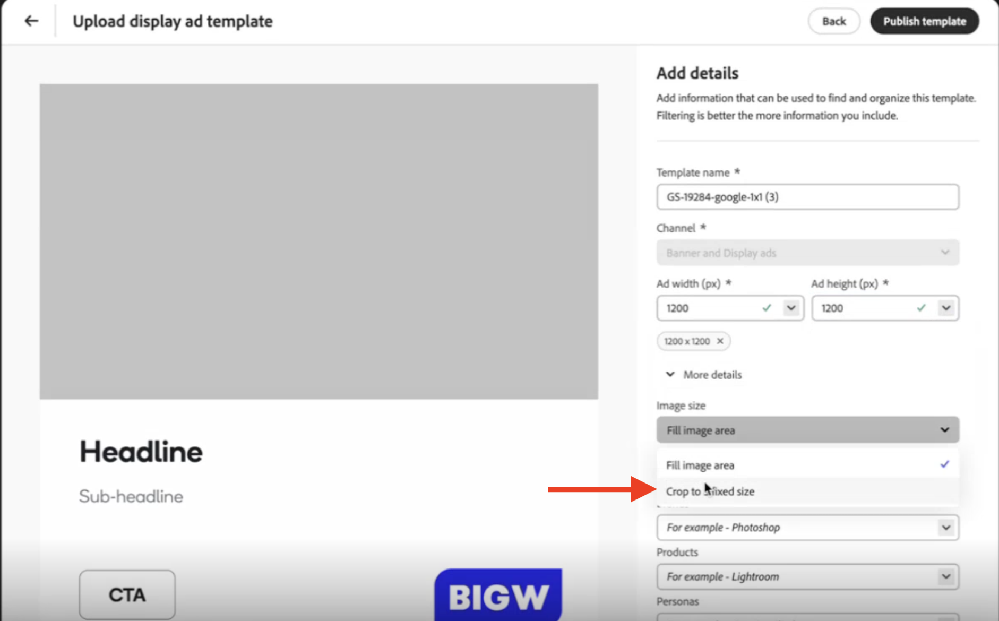

# Anzeigenvorlagen-Richtlinien anzeigen

Anzeigevorlagen sind vorkonfigurierte Layouts, mit denen visuell ansprechende Banner- und Display-Anzeigen erstellt werden. Sie bieten ein flexibles Framework für die Integration von Bildern, Text und call to action und stellen so Konsistenz und Effizienz bei der Produktion mehrerer Anzeigenvarianten sicher. Wenn Sie Ihre Vorlage für die Verwendung in GenStudio for Performance Marketing vorbereiten, stellen Sie sicher, dass alle Assets für die Web-Anzeige optimiert sind und die erforderlichen Dateiformate und -größen erfüllen.

Befolgen Sie die folgenden Best Practices für das Design, wenn Sie die Anzeigenvorlagen für Banner und Anzeigen an GenStudio for Performance Marketing anpassen:

- Verwenden von Adobe- oder Google-Schriftarten
- Vorbereiten von Assets, die in schlanken Dimensionen gut angezeigt werden
- Es ist genau ein Bildfeld erforderlich
- Verwenden **nicht** eingebettete oder kodierte Hintergrundbilder
- Verwenden Sie Hintergrundbilder (`image` Feld), die in das GenStudio for Performance Marketing-Inhalts-Repository hochgeladen wurden. Die besten Ergebnisse erzielen Sie, wenn Sie die Richtlinien unter [Hochladen von Bildern ](#uploading-images-for-display-ads) Display-Anzeigen“ befolgen
- Verwenden **nicht** JavaScript
- Es kann nur ein Abschnitt verwendet werden, wodurch ein einziger Satz von Vorlagenelementen erzeugt wird

## Erkannte Feldnamen

Verwenden Sie beim Anpassen Ihres Banners oder Ihrer Anzeigenvorlage Platzhalter für Inhalte für die folgenden erforderlichen Felder:

- `headline`
- `sub_headline`
- `body`
- `image` (erforderlich, ausgewählt aus Content JPEG, PNG oder GIF)

GenStudio for Performance Marketing generiert automatisch die folgenden Felder. Sie müssen keine Platzhalter für Inhalte anwenden für:

- `cta`

Weitere Informationen [ Verwendung von Feldnamen in Vorlagen finden ](/help/user-guide/content/customize-template.md#content-placeholders) unter „Platzhalter für Inhalte“.

## Unterstützte Dimensionen

Breite x Höhe (Pixel) müssen festgelegt werden.

| Ausrichtung | Abmessungen (Pixel) | Anmerkungen |
|--------------|-------------------------------------------------------------|------------------------------------------------------------------|
| Vertikal | 300 x 600 160 x 600 | Häufig für Wolkenkratzer und Banner mit halben Seiten. |
| Horizontal | 300 x 250 728 x 90 336 x 280 320 x 50 970 x 250 | Standardmäßige Leaderboard-, mittlere Rechteck- und Bannergrößen. |
| Benutzerdefiniert | 50 x 50 bis 2000 x 2000 | Für nicht standardmäßige oder eindeutige Platzierungen verwenden; Plattformbeschränkungen überprüfen. |

## Hochladen von Bildern für Display-Anzeigen

Bilder, die in Display-Anzeigen verwendet werden, sollten aus dem Inhalts-Repository stammen und müssen korrekt hochgeladen werden, um sicherzustellen, dass das Bild in der Vorlage korrekt angezeigt wird.

Wenn eine Anzeigevorlage ein Bild mit vollständigem Anschnitt (full bled) aufweist, wird die Größe des ausgewählten Bildes automatisch an die vollständigen Vorlagenabmessungen angepasst. Wenn das Bild jedoch nicht dem Seitenverhältnis der Vorlage entspricht, wird das Bild entsprechend den Vorlagenabmessungen zugeschnitten und möglicherweise nicht wie erwartet angezeigt.

Es gibt keine „AutoFit“-Funktion für Bilder in Display-Anzeigenvorlagen.

Um das Zuschneiden von Bildern zu beheben, müssen Benutzende das Seitenverhältnis des Bildes in der Vorlage definieren, wenn es in das Inhalts-Repository hochgeladen wird. Beim Hochladen einer genehmigten Anzeigen-Vorlage:

1. [Durchlaufen Sie den Upload-Prozess der Vorlage](/help/user-guide/content/use-templates.md#add-a-template) bis Sie die Seite **[!UICONTROL Details hinzufügen]** erreichen.

1. Definieren Sie das Seitenverhältnis des in der Vorlage zu verwendenden Bildes in **[!UICONTROL Anzeigenbreite (px)]** und **[!UICONTROL Anzeigenhöhe (px)]**. Dadurch wird das Bildfenster für den Bereich der Vorlage definiert, in dem das Bild angezeigt wird.

1. Wählen Sie im Abschnitt **[!UICONTROL Weitere]**) das Dropdown-Menü **[!UICONTROL Bildgröße]** und wählen Sie _Auf eine feste Größe zuschneiden_.
   {width="80%"}

So bestimmen Sie die Größe und das Seitenverhältnis eines Bildes im Browser:

1. Überprüfen Sie das Bild.
   - Windows/Linux:
      - Drücken Sie F12.
   - macOS:
      - Drücken Sie Befehlstaste + Wahltaste + I.

1. Bewegen Sie den Mauszeiger über das Bild.

1. Beachten Sie das Seitenverhältnis. Verwenden Sie diese Option, um das Seitenverhältnis des Bildes in der Vorlage zu definieren.

Wenn diese Details beim Hochladen nicht angewendet werden, wird davon ausgegangen, dass das Bild das gesamte Seitenverhältnis der Vorlage ist, und Bilder, die nicht genau diesem Seitenverhältnis entsprechen, werden abgeschnitten angezeigt.

{width="60%"}

**❌Zugeschnittenes Bild in einer Anzeige-Vorlage**

{width="60%"}

**✅Bild vollständig angezeigt**
