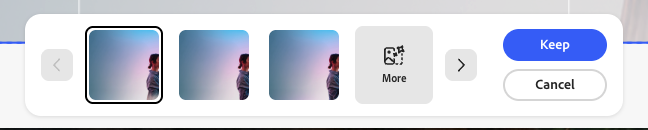

# Verwenden von [!DNL Adobe Express]

[!DNL GenStudio for Performance Marketing] können Vorlagen verwenden, die in [!DNL Adobe Express] erstellt und entworfen wurden. Bringen Sie Marken-Assets aus [!DNL Adobe Express] und verwenden Sie diese leistungsstarken Tools, um sie in überzeugende Marketing-Kampagnen und -[!DNL Experiences] zu integrieren.

In diesem Handbuch werden die Anforderungen und Funktionen für Vorlagen aus [!DNL Adobe Express] erläutert.

## Über Vorlagen in [!DNL Adobe Express]

[!DNL Adobe Express] können [neue Dokumente mithilfe vorhandener Starter-Vorlagen“ erstellt ](https://helpx.adobe.com/express/web/documents-and-presentations/text-flow-template.html?x-product=Helpx%2F1.0.0&x-product-location=Search%3AForums%3Alink%2F3.7.5), die im Programm bereitgestellt werden, oder mithilfe [benutzerdefinierter Vorlagen“, die hilfreiche Markenbeschränkungen enthalten können, ](https://helpx.adobe.com/express/web/brands-libraries-projects/create-manage-brands/edit-shared-template.html). B.:

- [Gesperrte Elemente](https://helpx.adobe.com/express/web/invite-collaborate/object-locking.html) die nicht geändert werden können
- Sperrbeschränkungen, die steuern, wie Benutzer Elemente bei Bedarf entsperren können

Sperreinstellungen, die für die Vorlage in [!DNL Adobe Express] festgelegt wurden, werden auch in [!DNL GenStudio for Performance Marketing] angewendet. Verwenden Sie [die  [!DNL Adobe Express] -Anweisungen, um eine benutzerdefinierte Vorlage mit Markenbeschränkungen zu ](https://helpx.adobe.com/express/web/brands-libraries-projects/create-manage-brands/template-control.html).

Um benutzerdefinierte Schriftarten in einer Express-Vorlage zu verwenden, müssen Administratoren zunächst das Angebot für die Qualifizierung benutzerdefinierter Schriftarten in der Admin Console akzeptieren, die im Rahmen der Express-Lizenzberechtigung enthalten ist.

## Express-Vorlagen suchen

Benutzern werden neue Registerkarten in Erstellen angezeigt, um Express-Vorlagen auszuwählen. Auf Express-Vorlagen kann in GenStudio for Performance Marketing zugegriffen werden, wenn diese Vorlagen:

- Erstellt von Benutzer
- Für Benutzer freigegeben
- Wird für die Organisation des Benutzers freigegeben und verwendet dieselbe IMS-Organisation in beiden Apps

Suchen Sie nach verfügbaren Express-Vorlagen im Workflow Erstellen , nachdem Sie einen Vorlagentyp ausgewählt haben. Express-Vorlagen sind nur für die folgenden Typen verfügbar:

- [!DNL Meta]
- [!DNL Display]
- [!DNL LinkedIn]
- [!DNL TikTok]

Suchen Sie in der oberen Leiste unter **[!UICONTROL Vorlage auswählen]** nach **Express-Vorlagen**.

{width=70%}

Wenn Sie eine [!DNL Express] auswählen und auf **[!UICONTROL Verwenden]** klicken, werden die Vorentwurfsparameter und die Eingabeaufforderung in einem Popup-Fenster auf der linken Seite angezeigt. Klicken Sie auf **[!UICONTROL Generieren]**, um mit der ausgewählten Vorlage neuen Inhalt zu erstellen.

{width=90%}

>[!IMPORTANT]
>
>Bei der Inhaltserstellung werden Express-Vorlagenebenen automatisch mit Feldrollen für [!DNL GenStudio for Performance Marketing] getaggt. Elemente in einer Vorlage können auch [manuell) ](#manual-tagging-of-templates) werden.

## Über Varianten und [!DNL Experiences] mit [!DNL Adobe Express] Vorlagen

[!DNL Express] Vorlagen bieten viele Funktionen, mit denen Sie auch bei der Verwaltung [ Varianten vertraut ](https://experienceleague.adobe.com/en/docs/genstudio-for-performance-marketing/user-guide/create/manage-variants#manually-edit-text). Es gibt jedoch einige leistungsstarke Ergänzungen, um jeden Workflow für Inhalte aus [!DNL Express] zu optimieren. In diesem Abschnitt werden Funktionen beschrieben, die ausschließlich in der [!DNL Adobe Express]-Implementierung enthalten sind.

### Mehrere Größen automatisch erstellen

Wenn [mehrere Seiten für ein Asset in erstellt wurden [!DNL Express]](https://helpx.adobe.com/express/web/arrange-layers-and-pages/add-pages.html) werden diese Seiten in alle Vorlagen übertragen, die aus diesem Asset erstellt wurden. Express-Seiten generieren jeweils verschiedene Größen des kreativen Inhalts in [!DNL GenStudio for Performance Marketing].

Wenn für ein Asset in [!DNL Express] Inhalte in mehreren Größen vorhanden sind, können Varianten für alle diese Größen in einer einzigen Generation generiert werden.

### Elemente neu positionieren und in der Größe ändern

Elemente in einer Vorlage können in der Größe angepasst oder verschoben werden, indem Sie einfach auf diese Elemente klicken und sie auf die Arbeitsfläche ziehen.

Ändern Sie die Größe, indem Sie auf ein Element klicken und es von einem Eckpunkt ziehen.

### Kopfzeilenfunktionen der Arbeitsfläche

Verwenden Sie die Schaltflächen in der Kopfzeile des Arbeitsflächen-Bereichs, um:

1. Entwurf umbenennen
1. Ändern des Zoomfaktors für die Anzeige
1. Rückgängigmachen und Wiederholen von Änderungen

### Zuweisen von Feedback zur Erlebnisgruppe

Weisen Sie jeder Gruppe generierter Varianten Feedback zu. Diese Feedback-Kennzeichnungen helfen der KI zu verstehen, welche Varianten in nachfolgenden Generationen berücksichtigt werden sollten.

Klicken Sie auf &quot;…“ So öffnen Sie das Dropdown-Menü für:

- Gute Leistung
- Schlechte Leistung
- Löschen - Löscht die Variantengruppe.

### Löschen von Varianten

Eine einzelne Variantengröße, die in einer Gruppe von Erlebnissen erzeugt wurde, kann mithilfe des Papierkorbsymbols gelöscht werden.

{width=300}

### Leertaste-zu-Schwenk

Halten Sie **[!UICONTROL Leertaste]** gedrückt, um eine Klick- und Ziehen-Funktion zu aktivieren und den Ansichtsbereich der Arbeitsfläche zu „ziehen“.

Sie können den Ansichtsbereich auch mit einem Bildlauf mit zwei Fingern verschieben.

### Text manuell bearbeiten

Sie können die Textfelder in generierten Varianten bearbeiten. Verfeinern Sie den Text für Ihre Zielgruppe, indem Sie mit verschiedenen Sätzen und Ausdrücken experimentieren und Formatierungen anwenden. Sie können beispielsweise den Text für eine Variante fett formatieren und mit der rechten Maustaste ausrichten, um das Layout eines Bildes zu berücksichtigen.

{width=60%}

Die verfügbare Textformatierung umfasst:

- Fett, Kursiv und Unterstrichen
- Textfarbe (schwarz, weiß oder Markenfarben)
- Links, Mitte und rechts ausrichten
- Aufzählungslisten und geordnete Listen
- Textgröße
- Hochgestellt oder tiefgestellt

**So bearbeiten Sie Text in generierten Varianten manuell**:

1. Doppelklicken Sie nach dem Generieren eines Variantensatzes auf bearbeitbaren Text in einer Variante.
1. Neuen Text eingeben.
1. Um den Text zu formatieren, klicken Sie auf oder geben Sie in das Textfeld ein. Formatierungsoptionen werden in einer Popup-Leiste angezeigt. Wenn Sie die Umschalttaste gedrückt halten, wird die Leiste ausgeblendet, um den Text anzuzeigen.
1. Klicken Sie auf eine Stelle außerhalb des Textfelds, um Änderungen zu speichern.

### Ebenen anzeigen

Sie können schnell eine einzelne Ebene einer Variante auswählen und Änderungen vornehmen, z. B. Abschnitte neu generieren oder Bilder zuschneiden. Wenn Sie eine einzelne Ebene auswählen, werden die bearbeitbaren Felder oder Bilder innerhalb der Ebene hervorgehoben.

**Anzeigen der Ebenen einer Variante**:

1. Nachdem Sie einen Variantensatz generiert haben, klicken Sie auf ein bearbeitbares Feld oder Bild in einer Variante. Ebenen werden in einer Reihe von Kacheln oben rechts angezeigt.
   {width=50%}
1. Klicken Sie auf eine Ebenenkachel, um sie auszuwählen. Die ausgewählte Ebene wird für die Variante hervorgehoben.
1. Nehmen Sie die erforderlichen Änderungen an der ausgewählten Ebene vor.

### Abschnitte neu schreiben

[!DNL GenStudio for Performance Marketing] verfügt über integrierte Funktionen zum Regenerieren von Abschnitten generierter Varianten. Sie können Text umformulieren, kürzen oder verlängern oder neue Eingabeaufforderungen hinzufügen, um neue Inhalte zu generieren.

Sie können beispielsweise den Überschriftenabschnitt einer Meta-Anzeigenvariante neu generieren, um zu sehen, wie er mit einem bestimmten Hintergrund-Asset aussieht. Sie können **[!UICONTROL Textinhalt eines Abschnitts]** **[!UICONTROL kürzen]** oder **[!UICONTROL verlängern]** oder Text **[!UICONTROL neu generieren]** indem Sie eine Eingabeaufforderung verwenden.

{width=50%}

**So schreiben Sie einzelne Variantenabschnitte neu**:

1. Nachdem Sie einen Variantensatz generiert haben, klicken Sie mit einem Mausklick auf einen beliebigen bearbeitbaren Text in einer Variante. Das Zauberstab-Symbol wird angezeigt.
1. Klicken Sie auf das Zauberstab-Symbol, um den Rewrite-Bereich zu öffnen.
1. Um den vorhandenen Text zu ändern, wählen Sie **[!UICONTROL Umformulieren]**, **[!UICONTROL Kürzen]** oder **[!UICONTROL Verlängern]** aus.
1. Um neue Formulierungsoptionen zu generieren, wählen Sie **[!UICONTROL Erneut generieren]** und geben Sie eine neue Eingabeaufforderung ein.
   1. Klicken Sie auf **[!UICONTROL Generieren]**.
1. Die Ergebnisse werden als Optionen im Bereich angezeigt. Wählen Sie die gewünschte Option aus und klicken Sie auf **[!UICONTROL Ersetzen]**. Die Variante wird mit dem überarbeiteten Text aktualisiert.

{width=50%}

### Assets zuschneiden

Sie können Bild-Assets in einzelnen generierten Varianten mit dem Tool Zuschneiden manuell zuschneiden und neu positionieren.

**So schneiden Sie Bilder in Varianten zu und positionieren sie neu**:

1. Doppelklicken Sie nach dem Erzeugen eines Variantensatzes auf ein Asset, um den Begrenzungsrahmen zu aktivieren.
1. Passen Sie den Bildbegrenzungsrahmen an, indem Sie ihn von einer beliebigen Kante oder Ecke ziehen, oder ziehen Sie das gesamte Bild in die gewünschte Position.

### Austauschen von Assets

Sie können Bilder, genehmigte Logos oder Video-Assets in generierten Varianten direkt über die Benutzeroberfläche der Arbeitsfläche hinzufügen oder austauschen.

**Hinzufügen oder Austauschen von Assets in einer Variante**:

1. Nachdem Sie einen Variantensatz generiert haben, klicken Sie auf ein Asset (oder den Bereich des Bild-Assets, wenn derzeit kein Bild vorhanden ist). Ein Symbol „Austauschen“ wird angezeigt.
1. Klicken Sie auf das Symbol Austauschen , um die Seite Assets auswählen zu öffnen.
1. Verwenden Sie die Filter- und Suchfunktion in der GenStudio Assets-Inhaltsansicht, um Ihre Suchergebnisse weiter einzugrenzen.
1. Sie können auch Bilder verwenden, die in Connected [!DNL Adobe Experience Manager] (AEM) Assets Content Hub-Repositorys verfügbar sind, indem Sie dieses Repository aus dem Menü **[!UICONTROL Speicherort]** auswählen.
1. Klicken Sie, um ein Bild auszuwählen, und klicken Sie auf **[!UICONTROL Verwenden]**. Das Bild wird hinzugefügt oder durch die entsprechende Variante ersetzt.

### Manuelles Tagging von Vorlagen

Elemente in Vorlagen werden während der [Vorlagenerstellung) ](#find-express-templates) Erstellungs-Workflow automatisch mit Tags versehen. Diese Elemente können jedoch auch manuell mit Tags versehen werden.

**So kennzeichnen Sie ein Vorlagenelement manuell**:

1. Wählen Sie das Element in der Vorlage aus.
1. Wählen Sie das Tag für dieses Element aus dem Dropdown-Menü aus.
   {width=80%}

Die Tagging-Optionen variieren je nach Elementtyp.

### Einschränkungen bei Vorlagensperren

Vorlagen können [gesperrte Elemente](https://helpx.adobe.com/express/web/invite-collaborate/object-locking.html) enthalten, die von [!DNL Express] übernommen werden und steuern, wie einige Funktionen geändert werden können. Diese Einstellungen werden von der Vorlage berücksichtigt und können auch in der Vorlage geändert werden:

1. Ein gesperrtes Element in der Vorlage auswählen.
1. Klicken Sie oben links für das ausgewählte Element auf das Schlosssymbol.
1. Wählen Sie die richtige Option zum Entsperren des Elements aus.
   {width=60%}

### Video-Assembly

Vorlagen, die Videos enthalten, können die Funktionen für die Videoassembly nutzen.

**So verwenden Sie die Videoassembly**:

1. Wählen Sie ein Erlebnis aus und klicken Sie auf **[!UICONTROL Bearbeiten]**, um in den Fokusmodus zu wechseln und Videoassemblyfunktionen zu verwenden. Nur die einzelne Variante wird angezeigt, und die Szenenzeile wird am unteren Rand angezeigt.
   {width=70%}
1. Passen Sie Ihr Videoerlebnis an. Zu den Optionen für die Videoassembly gehören:
   - Videos abspielen
   - Stummschaltung und Stummschaltung aufheben
   - Hinzufügen neuer Videoinhalte mit der Schaltfläche &quot;+&quot;
   - Einstellungen für Videodauer
   - Ändern der Reihenfolge von Videoinhalten durch Ziehen und Ablegen
1. Wenn Sie die Bearbeitung des Videos abgeschlossen haben, verwenden Sie die Schaltfläche **[!UICONTROL Beenden]** oben, um Änderungen zu speichern und zur unendlichen Arbeitsfläche zurückzukehren.

### Ändern von Bildern mit „Generativ erweitern“

Die Grenzen von Bildebenen können mit KI erweitert werden, damit sie in ein Erlebnis in jeder gewünschten Dimension passen.

**So erweitern Sie ein Bild mit Generative**:

1. Wählen Sie eine entsperrte Bildebene aus und klicken **[!UICONTROL unten im Bildrahmen auf]** Schaltfläche „Erweitern“.
   {width=70%}
1. Ziehen Sie den Rahmen auf die gewünschten Abmessungen, in denen das Bild erweitert werden soll. Das Fenster „Optionen erweitern“ wird angezeigt. In den Optionen zum Erweitern können Sie die Erweiterung vereinfachen, indem Sie:
   - Eingabeaufforderung eingeben
   - An Rahmen anpassen
   - Dimensionen zurücksetzen
     {width=50%}
1. Klicken Sie **[!UICONTROL Erweitern]**, um die Generierung zu erstellen. Varianten zur Auswahl erscheinen unten im Rahmen.
1. Wählen Sie die beste Variante aus und klicken Sie auf **[!UICONTROL Beibehalten]**.
   {width=50%}

{width=60%}

### Markenvalidierung

Verwenden Sie das _Inhaltsüberprüfung_-Bedienfeld, um eine konsistente Markenidentität, ADA-Barrierefreiheitsstandards, Platform-Richtlinien und die Ausrichtung von Varianten beizubehalten.

Siehe [Markenvalidierung](/help/user-guide/guidelines/brand-validation.md).

## Überprüfen und genehmigen

Genehmigen und veröffentlichen Sie nach der Bearbeitung und Anpassung Ihrer Varianten Ihren Inhalt mit dem Workflow [Überprüfungen und Genehmigungen](https://experienceleague.adobe.com/en/docs/genstudio-for-performance-marketing/user-guide/approve/overview).
